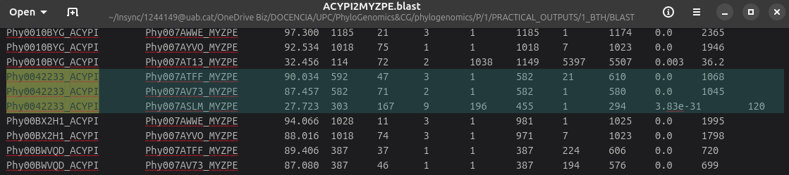
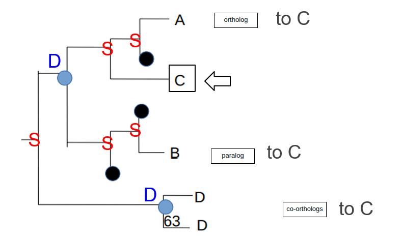
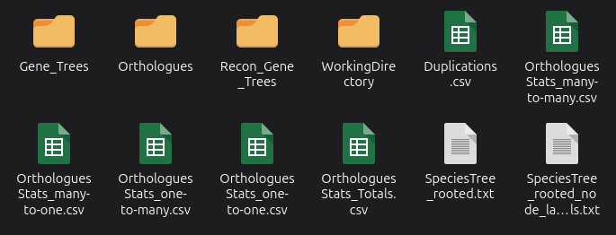
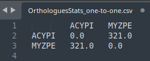

```{r setup, include=FALSE}
options(htmltools.dir.version = FALSE)
#knitr::include_graphics()
knitr::opts_chunk$set(
  cache = TRUE,
  message = FALSE, 
  warning = FALSE,
  hiline = TRUE,
  fig.retina = 5
)
library(ggplot2)
library(readr)
library(knitr)
#pagedown::chrome_print(".html")
```

```{r xaringan-themer, include=FALSE, warning=FALSE}
library(xaringanthemer)
style_mono_accent(
  base_color = "#1c5253", link_color =  "#DE1144", code_inline_color = "#DE1144",
  header_font_google = google_font("Josefin Sans"),
  text_font_google   = google_font("Montserrat", "400", "400i"),
  code_font_google   = google_font("Roboto Mono"),
    
)
```

```{r xaringanExtra-clipboard, echo=FALSE}
library(xaringanExtra)
htmltools::tagList(
  xaringanExtra::use_clipboard(
    button_text = "<i class=\"fa fa-clipboard\"></i>",
    success_text = "<i class=\"fa fa-check\" style=\"color: #90BE6D\"></i>",
  ),
  rmarkdown::html_dependency_font_awesome()
)
```


class: animated, fadeIn

# P2 quiz revision

## Overall performance

> Average: **8.81** (46 participants)<br><br>
> 11 participants with a 10

<style>
.title-slide {
  background-image: url('img/1_p.png');
  background-size: 100%;
}
</style>

---

class: animated, fadeIn

# Challenging question (1)

### **Does Phy0042233_ACYPI have any other homologs in MYZPE?**

> 🔑 This information may not be found in the two output files of the script!

--

1. We needed to revise the BLAST result (the same result is obtained either if we use `MYZPE2ACYPI.blast`  or `ACYPI2MYZPE.blast`)
2. Three matches for Phy0042233_ACYPI can be found: one we already knew (the BRH, *Phy007ATFF_MYZPE*), and two more:
<center>

</center>
<br>

> **Correct answer: ** **Two other homologs**

---

class: animated, fadeIn

# Challenging question (2)

### What are genes A, B and D (both genes) with respect C?

<center>


---

class: animated, fadeIn

# Challenging question (3)

### Look at the different output files produced by OrthoFinder, many of which contain valuable information. How many orthologs have a one-to-one relationship?

--

1. We needed to check the file `OrthologuesStats_one-to-one.csv`

.pull-left[
<center>

]
.pull-right[
<center>

]

<br>
<br>
> **Correct answer: ** **321**


---

class: animated, fadeIn

# Challenging question (4)

### Based on OrthoFinder, which proteins are orthologous to Phy0042233_ACYPI? Is this result congruent with the previous results from InParanoid? 

Note that NOT all orthogroup members are orthologs among them. You may need to review the theory slides for this practical session before answering this question.

--

1. According to InParanoid results: (`table.ACYPI.fa-MYZPE.fa`):<br>
`74	1062	Phy0042233_ACYPI 1.000 	Phy007ATFF_MYZPE 1.000 Phy007AV73_MYZPE 0.138` 

2. According to OrthoFinder (`Orthogroups.csv`):<br>
`OG0000016	Phy0042233_ACYPI, Phy00BWVQD_ACYPI	Phy007ATFF_MYZPE, Phy007AV73_MYZPE`


> **Important**: Inside an OrthoGroup of OrthoFinder, we can have both orthologs but also in-paralogs. 

<br>

> **Correct answer: Phy007ATFF_MYZPE, Phy007AV73_MYZPE. This result is congruent with InParanoid's results**


---

class: animated, fadeIn

# Challenging question (5)

###  How many duplication events are shared between ACYPI and MYZPE, and how many duplications are species-specific?

--

1. We needed to check the file `Duplications.csv` and count the number of shared and terminal (i.e., the one only with species-specific). There are several ways of counting it, example with `R`:

```{r}
dups <- data.table::fread("img/Duplications.csv")
table(dups$Type)
```

<br>

> **Correct answer: 10 shared, 36 species-specific**


---

class: animated, fadeIn

# Challenging question (6)

###  Now go to the folder `set_b`, which includes the results produced by running OrthoFinder on three species (ACYPI, MYZPE and SIPHA). How many duplication events are shared between the three species? 

--

1. As before, we check the `Duplications.csv` file, and look for lines where we see the three species (ACYPI, MYZPE and SIPHA)

`grep SIPHA Duplications.csv | grep MYZPE | grep ACYPI | wc -l`

> **Correct answer: 2**


---

class: animated, fadeIn

# Challenging question (7)

### Check which of the three species is less represented in the orthogroups. Which of the following statements are possible explanations, if any?

a. This species has more predicted genes than the other two species but some genes of their genes can be clustered in a single group composed of orthologs of its own species ❌

b. It make sense. We commonly observe that the most distantly related species have fewer genes in common with the other species of the dataset ✅

c. The genome of this species could have not been properly annotated, some genes may be missing in the annotations and therefore not inferred as members of orthogroups ✅ 

---

class: animated, fadeIn

#### The exercise on reconstructing a tree and doing the reconciliation was not evaluated (this exercise was too complex and will be revised for next year)

#### Today with Marta you'll do a learn how to do tree reconstruction!

---
class: animated, fadeIn

## Contact

<div style="margin-top: 20vh; text-align:center;">

| Marta Coronado Zamora | 
|:-:|
| <a href="mailto:marta.coronado@uab.cat"><i class="fa fa-paper-plane fa-fw"></i> marta.coronado@uab.cat</a> | 
| <a href="https://bsky.app/profile/geneticament.bsky.social"><i class="fab fa-bluesky fa-fw"></i>&nbsp; @geneticament.bsky.social</a> | 
| <a href="https://www.uab.cat"><i class="fa fa-map-marker fa-fw"></i>&nbsp; Universitat Autònoma de Barcelona</a> | 

