```{r setup, include=FALSE}
options(htmltools.dir.version = FALSE)
#knitr::include_graphics()
knitr::opts_chunk$set(
  cache = TRUE,
  message = FALSE, 
  warning = FALSE,
  hiline = TRUE,
  fig.retina = 5
)
library(ggplot2)
library(readr)
library(knitr)
#pagedown::chrome_print(".html")
```

```{r xaringan-themer, include=FALSE, warning=FALSE}
library(xaringanthemer)
style_mono_accent(
  base_color = "#1c5253", link_color =  "#DE1144", code_inline_color = "#DE1144",
  header_font_google = google_font("Josefin Sans"),
  text_font_google   = google_font("Montserrat", "400", "400i"),
  code_font_google   = google_font("Roboto Mono"),
    
)
```

```{r xaringanExtra-clipboard, echo=FALSE}
library(xaringanExtra)
htmltools::tagList(
  xaringanExtra::use_clipboard(
    button_text = "<i class=\"fa fa-clipboard\"></i>",
    success_text = "<i class=\"fa fa-check\" style=\"color: #90BE6D\"></i>",
  ),
  rmarkdown::html_dependency_font_awesome()
)
```


class: animated, fadeIn

# Outline

- What is a gene?

- Protein-coding and non-coding genes
  - Gene structure and expression
  - Functional roles of genes

- Relationships between sequence, structure, and function and their evolution
  - Homology-based functional inference
  - Protein domains and domain shuffling
  - Prediction of protein subcellular localization
  - _De novo_ origin of genes

- Pathways
  - The Gene Ontology
  - Enrichment analyses

<style>
.title-slide {
  background-image: url('img/1.png');
  background-size: 100%;
}
</style>


---

layout: false
class: left, bottom, inverse, animated, bounceInDown
# 01
## What is a gene?

---
class: animated, fadeIn

# What is a gene?

.pull-left[
<center>

]
.pull-right[

#### <a href="https://www.wooclap.com">www.wooclap.com</a> <i class="fa-solid fa-arrow-right"></i> Event code: **SKTJQE**
]

---
class: animated, fadeIn

# Back in the 1800s

- The existence of **discrete inheritable** units was first suggested by **Gregor Mendel** (1822-1884)

<center>
</img>

---
class: animated, fadeIn

# Key experiments (1940s-1950s)

--

.pull-left[

#### Avery-MacLeod-McCarty experiment ([1944](https://doi.org/10.1084/jem.79.2.137))
- *Streptococcus pneumoniae* strains


- **DNA** is the substance that causes bacterial transformation

]

--

.pull-right[

#### Hersey-Chase experiments ([1952](https://doi.org/10.1085/jgp.36.1.39))
- Bacteriophages

<center>
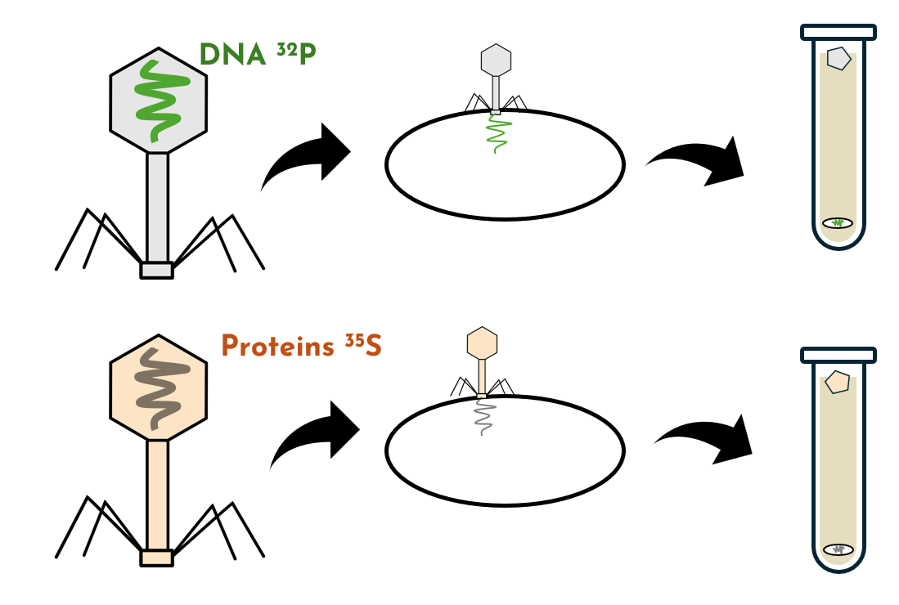
</center>

- **DNA** entered the bacteria to direct viral replication


]

--

> DNA/RNA was the physical support of the entities called _genes_

---
class: animated, fadeIn

# Modern definition

> **A sequence of DNA or RNA which codes for a molecule that has a function.** 

<center>
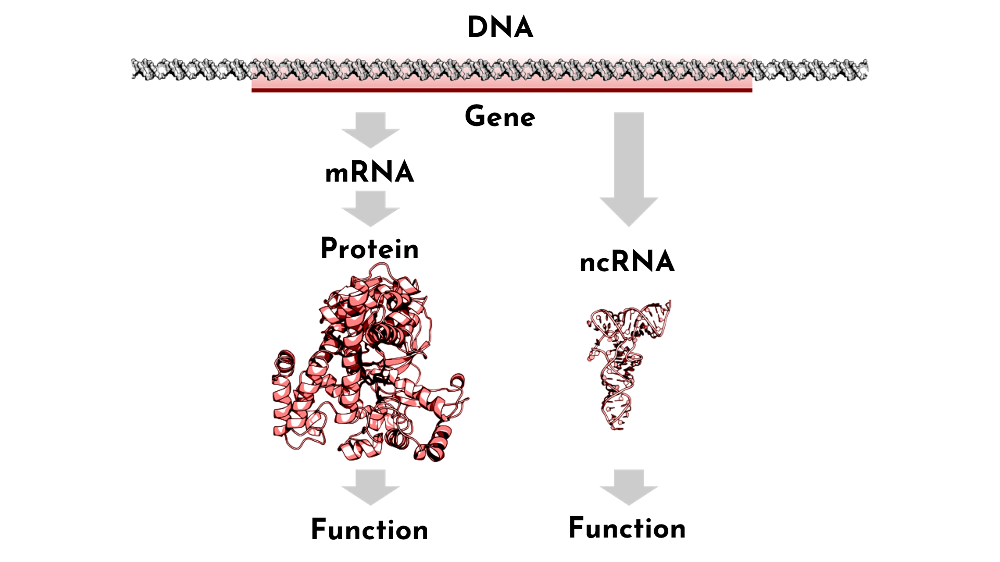
</center>

---

layout: false
class: left, bottom, inverse, animated, bounceInDown

# 02
## Protein-coding and non-coding genes

---
class: animated, fadeIn

# Gene structure and expression

### The difference between prokaryotic and eukrayotic genes


.pull-left[

<center>

<b>Prokaryotic gene</b>


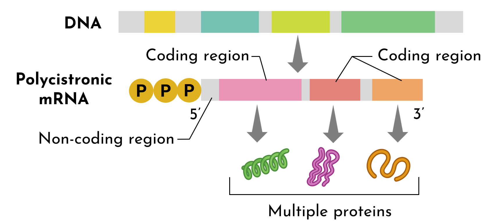
</center>

- A set of genes is transcribed together
- They usually encode for functions of the same pathway
- Stoichiometric relationship
]

.pull-left[

<center>
<b>Eukaryotic gene</b>
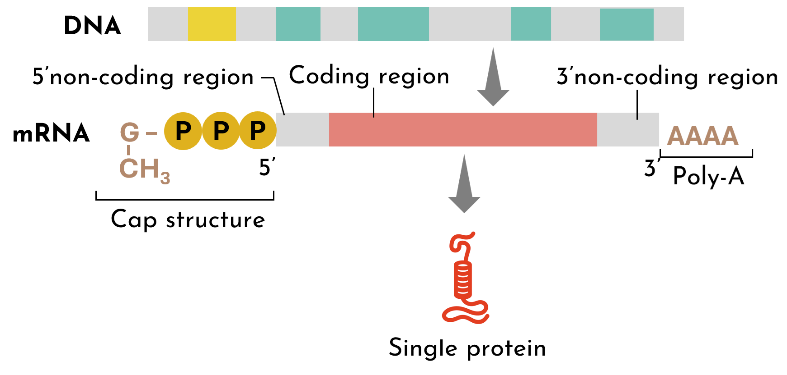
</center>

- Exons and introns (removed through splicing)
- Post-translational modifications: cap structure + poly-A tail (protect mRNA)
]

---
class: animated, fadeIn

# Gene structure and expression

- The pattern of gene activation can inform us of the **function** of a gene

--

**Gene expression** is a tighly-regulated process:
  - **Proteins**: transcription factors (activators, repressors)
  - **Sequences**: Promoters, Enhancers, TFBS

<center>

</center>

---

# Gene structure and expression

### Splicing

.pull-left[
<center>
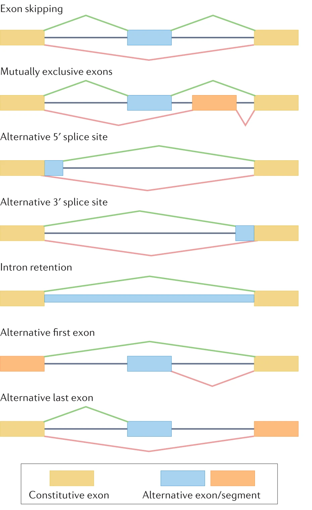
</center>
]

.pull-right[
- Eukaryotic **pre-mRNA splicing** is orchestrated by the **spliceosome**: catalyses removal of the intron and splicing together of the protein-coding exons via its RNA-based catalytic centre

- The architecture of a pre-mRNA before splicing:

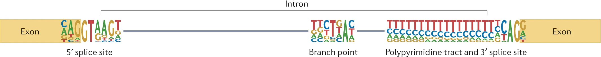

- The resulting proteins are functionally related but may have key differences in their substrate affinity and encode for slightly different functions

<small>
[Wright,Smith,& Jiggins (2022) Nat Rev Genet](https://doi.org/10.1038/s41576-022-00514-4)

]


---
class: animated, fadeIn

# Gene structure and expression

- Transcript nuclear export (in eukaryotes)

For protein-coding genes:
- **Ribosomes**: Translation into protein
- **Chaperones**: Protein folding 

<center>
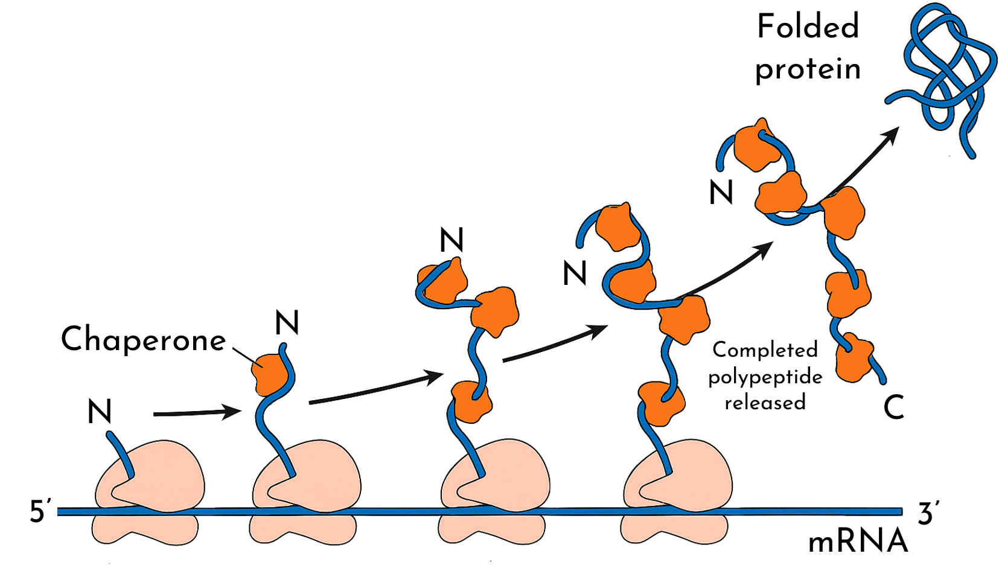

---
class: animated, fadeIn

# Modern gene definition

> **A sequence of DNA or RNA which codes for a molecule that has a function.** 

<center>

</center>


---
class: animated, fadeIn

# Functional role of genes

- What do we consider a function?

--

.pull-left[

**General functions**:

- Structural (e.g. Actin)
- Catalytic (e.g. Glycogen synthase)
- Regulatory (e.g. Transcription Factor)
- Several functions
- Etc.
]

--

.pull-right[
**Functional categories:**:

- Essential vs. non-essential
- Constitutive (housekeeping) vs. condition-specific
- Induced when facing a given stimulus
]

---

class: animated, fadeIn

# Functional role of genes

.pull-left[

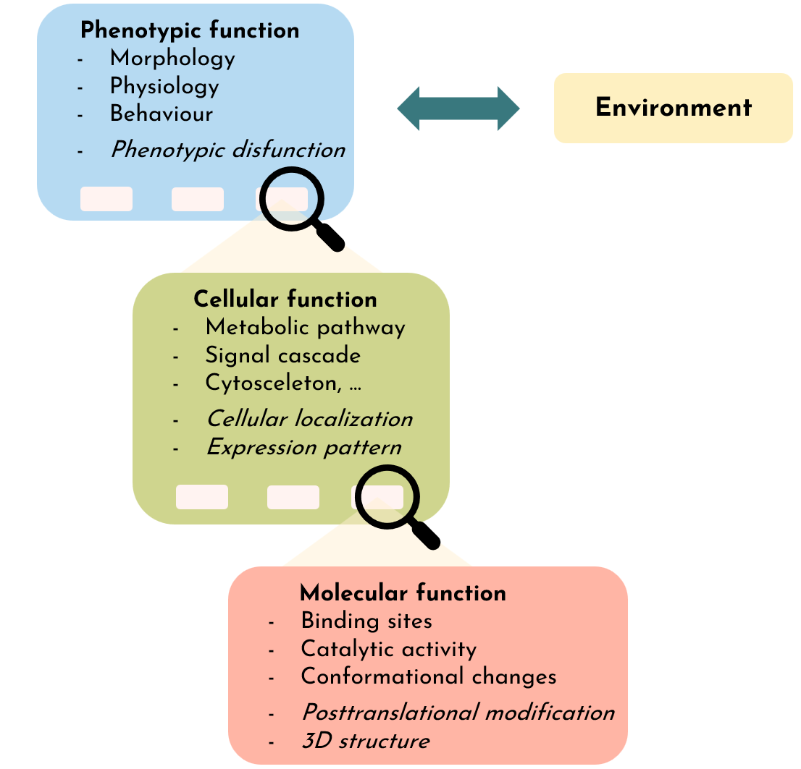
]

--

.pull-right[

**Levels of protein function:**

- **Molecular function**: activity that the molecule carries out.
-	**Cellular function**: the role the molecule carries out in the cell
  - Two proteins may have the same molecular function but carry out two different processes within the cell 
-	**Phenotypic function**: A broader level, the role the molecule has on the morphology or physiology of the organism

> For some genes we may know the phenotypic function, for some others only the cellular function

<br>

<small>
[Bork et al (1998)](https://doi.org/10.1006/jmbi.1998.2144)

]

---

layout: false
class: left, bottom, inverse, animated, bounceInDown
# 03
## Relationships between sequence, structure, and function and their evolution

---
class: animated, fadeIn

# What determines the function of a gene?

<center>

</center>

--

- The function of a gene is determined by the molecule carrying out that function (protein or ncRNA)
- Gene functions ultimately arise from the chemical and physical properties of these molecules
- These properties depend on the structure and interactions of the molecule


---
class: animated, fadeIn

# What determines the function of a gene?

-  The **3D structure is key**, which is in turn determined by the sequence. 

> The sequence determines the structure which determines the function.

<center>
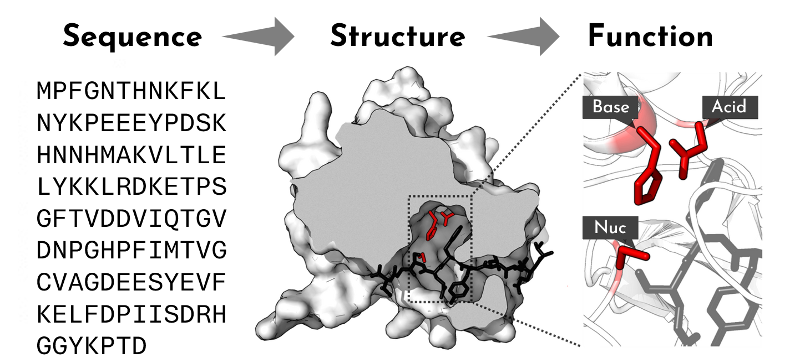
</center>

*Example*: The enzyme TEV protease contains a catalytic triad of residues (red) in its catalytic site. The substrate (black) is bound by the binding site to orient it next to the triad.

---

class: animated, fadeIn

## Protein structure

- There is a plethora of shapes that exist within the protein world: 
 
<center>
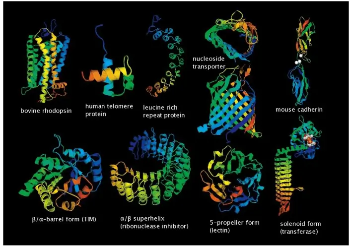
</center>

> Proteins fold into recurring structural motifs (e.g. α/β barrels, propellers, solenoids)<br>
> Different folds enable different molecular functions

---

class: animated, fadeIn

## RNA structure

The properties are determined by the structure which is in turn determined by the sequence. 
<center>
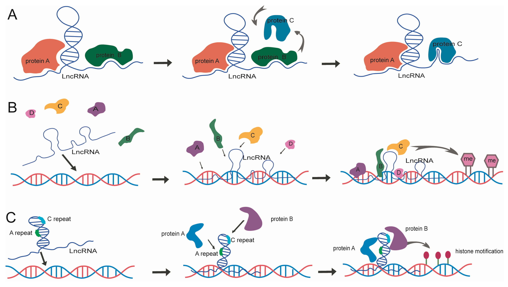
</center>

- LncRNA allostery effect for interacting with different ligand proteins.
- LncRNA acting as molecular scaffold to recruit and combine with multiple regulatory proteins.
- LncRNA mediating histone modification by the functional region repeat elements.

<small>
[Wang et al. 2017](https://doi.org/10.3390/ijms18122659)


---

class: animated, fadeIn

## Structure conservation

> A sequence can vary through **time**

Multiple sequence alignment (**MSA**) of Hemoglobin subunit alpha 1 for different species (R package `msaR`):


<br>

```{r echo = F}
library(msaR)

proteins <- ape::read.FASTA("img/hba.aln", type="AA")
msaR(proteins, menu = F, width = "10%", conservation= T, colorscheme="clustal2", overviewbox = F)
```


---


class: animated, fadeIn

## Structure conservation

> A sequence can vary through **time**


.pull-left[
<center>
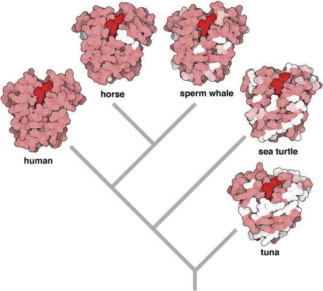
</center>
]

.pull-right[

- Phylogenetic reconstruction based on myoglobin sequences: evolutionary relatedness between species was reconstructed using the [https://www.phylogeny.fr/](https://www.phylogeny.fr/) web server.

- The colors show differences to the human transcript, which is used as reference; pink residues indicate identical amino acids; residues similar in physio-chemical properties are light pink; vastly different side-chains are white. The heme is shown in bright red. 

> Some regions are more **variable** than others, which remain more **conserved**
<small>

<br>


[Zaucha & Heddle et al. 2017](https://doi.org/10.1016/j.csbj.2017.05.002)

]

---


class: animated, fadeIn

## Phylogenetic trees

> Sequence evolution can be represented with a **phylogenetic tree** (R package `ggtree`)

<center>
```{r echo = F, fig.height=6}
library(ggtree)
tree <- read.tree("img/sample.nwk")
ggtree(tree, layout = "rectangular", size = 1) +
  geom_tree(color = "#4C4C4C") +
  geom_text2(
    aes(subset = !isTip, label = node),
    hjust = -0.3,
    color = "#D55E00",
    fontface = "bold",
    size = 5
  ) +
  geom_tiplab(
    size = 4,
    color = "#0072B2"
  ) +
  theme_tree2() +
  theme(
    plot.background = element_rect(fill = "white"),
    legend.position = "none"
  )
```


---

class: animated, fadeIn

# Homology-based functional inference

If sequence determines structure, which determines function, can we predict function from sequence?

<center>
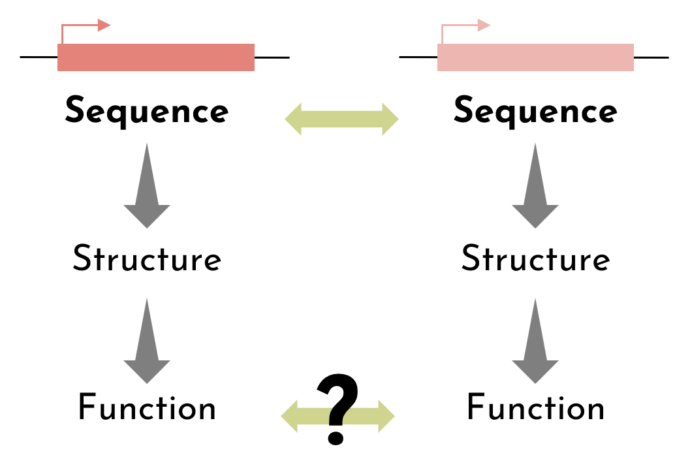
</center>

---

class: animated, fadeIn

# Homology-based functional inference

.pull-left[

]
.pull-right[
- *E. coli*, the most intensively studied organism:  2,556  genes (~54%) have been well-characterized, and 26% are partially characterized ([Moore et al. 2024](https://doi.org/10.1093/nar/gkae857))

- Key to employ **function prediction approaches**, because experiments are expensive, time-consuming, and require a prior hypothesis to plan the experimental procedure accordingly

]

---

class: animated, fadeIn

# Homology-based functional inference

<code>>protein<br>
MSEFATSRVESGSQQTSIHSIPIVQKLETDESPIQTKSEYTNAELPAKPIAAYWTVICLC
LMIAFGGFVFGWDTGTISGFVNQTDFKRRFGQMKSDGTYYLSDVRTGLIVGIFNIGCAFG
GLTLGRLGDMYGRRIGLMCVLYVYVGIYIQIASSDKWYQYFIGRIISGMGVGGIAVLSPT
LISETAPKHIRGTCVSFYQLMILTGILFYGTCNYGTKDYSNSVQWRVPLGLNFAFAIFMI
AQGMLVVPESPRFLVEKGYREDAKRSLANKSNKVTIEDPSIVAEMDTIMANVETERTLAG
NASWGELFSNKGAILPRVIMGIMIQSLQQLTGNNYFFYYGTTIFNAVGMKDSFQTSVLGI
VNFASTFVALYVDKFGRRKCLLGGSASMAICFVIFSTVGVTSLYPNGKDQPSSKAAGNVM
INFCTLCIFFFAISWAPIAIYVASESYPLRVKNRAMAAVGANWIWGFLIGFFTPFITSAI
GFSYGYVFMGCLVFSFFYVFFFVCETKGLTLEEVNEMVYEGVKPWKSGSWISKEKRVSE</code>

--

<h2>
<i class="fa fa-question-circle fa-fw"></i> What do we do?

---

class: animated, fadeIn

# Homology-based functional inference

<center>
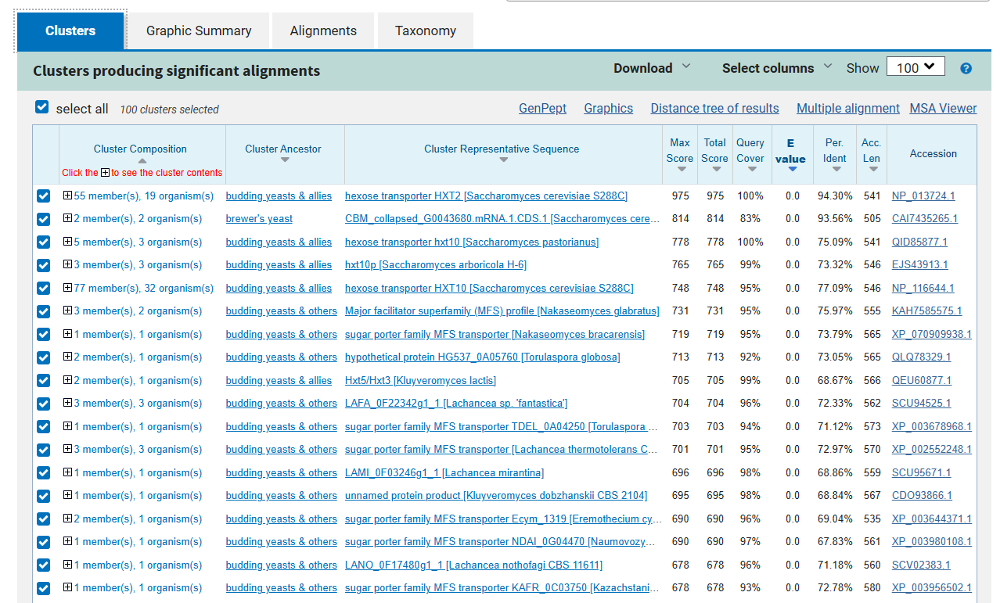

---


class: animated, fadeIn

# Homology-based functional inference

<center>
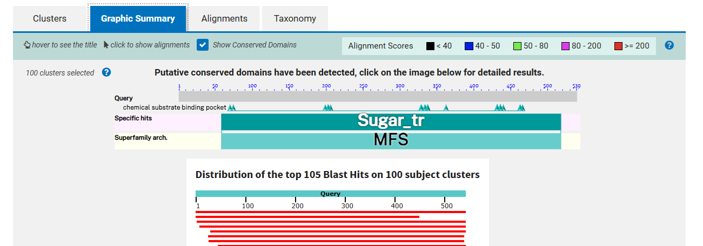
</center>


--

- First approach when tackling function annotation
- By looking at the function of the hits with higher score, we may identify keywords that are repeated
- Good to predict molecular functions, but give poor information as to higher levels of function
- *Example of transpoters*: although they share a conserved pore-like structure (easy to detect by sequence), small changes in key residues can drastically alter substrate specificity. Therefore, sequence alone is a poor predictor of cellular function.

---
class: animated, fadeIn

# Homology-based functional inference


.pull-left[


]


.pull-right[

-  Homology-based prediction is good to predict **molecular function** but not higher levels
- Also, be aware that few residue changes can drive changes in substrate affinity, etc. 

<br>
<br>
<br>
<br>
<br>
<br>
<br>
<br>
<br>
<br>
<br>
<br>
<br>
<br>
<small>
[Bork et al (1998)](https://doi.org/10.1006/jmbi.1998.2144)

]


---
class: animated, fadeIn

# Protein domains and domain shuffling

> Proteins do not work as a whole structure, but are rather **modular** in design, where different parts of the proteins have different functions

<center>


---
class: animated, fadeIn

# Protein domains and domain shuffling

> Proteins do not work as a whole structure, but are rather **modular** in design, where different parts of the proteins have different functions


#### Protein domains

- A conserved part of a given protein sequence and (tertiary) structure that can evolve, function and exist independently of the rest of the protein
- Each domain forms a compact three-dimensional structure and often can be independently stable and folded 
- Many proteins consist of several structural domains
- A domain may appear in a variety of different proteins
- Domains often form functional units, such as the calcium-binding EF hand domain calmodulin
- Some domains are **promiscious* meaning they can appear in diverse families in combination with other domains
  - when aligning two proteins, it is important to keep in mind whether the region of alignment extends only to a given domain or to the protein as a whole.
- Furthermore, domains can evolve independently, “jump” from one gene to the other, etc.
  - Protein families may share little sequence due to the differential presence/absence pattern of domains


---


class: animated, fadeIn

# Protein domains and domain shuffling

<center>
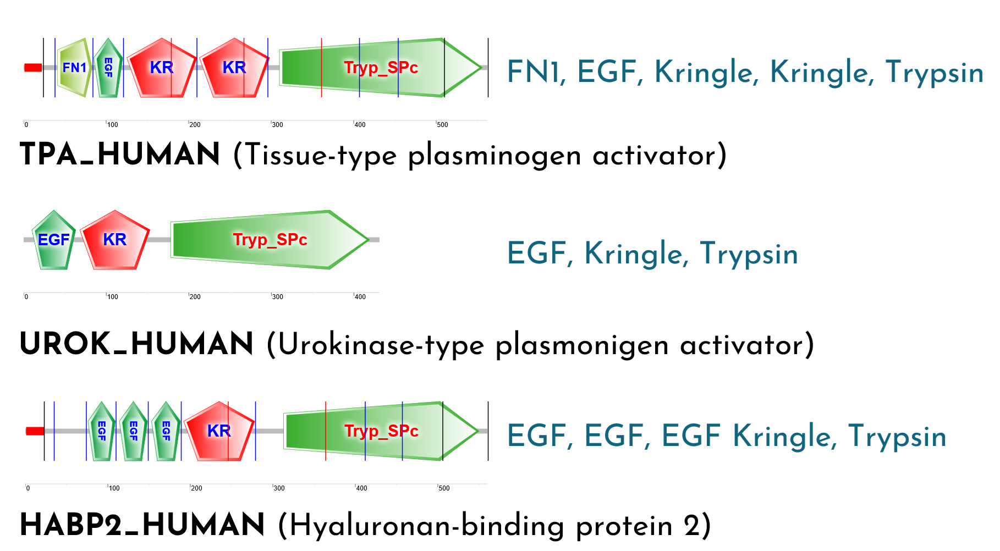

</center>

--
<br>

> This can confuse homology-based protein prediction (blast hits)

---
class: animated, fadeIn

# Protein domains and domain shuffling

> Domains are important, because the function may reside in the domain (and not in the preotin)

--

#### Tools

.pull-left[

- **SMART** (https://smart.embl.de/): web-based platform for identifying and annotating protein domains and analyzing domain architectures
  - [Letunic and Bork (2026)](https://academic.oup.com/nar/article/54/D1/D499/8277914)

- **PFAM** (https://www.ebi.ac.uk/interpro/): Pfam protein families database is a comprehensive collection of protein domains and families used for genome annotation and protein structure and function analysis
  -  [Paysan-Lafosse (2025)](https://academic.oup.com/nar/article/53/D1/D523/7900195)

]

.pull-right[

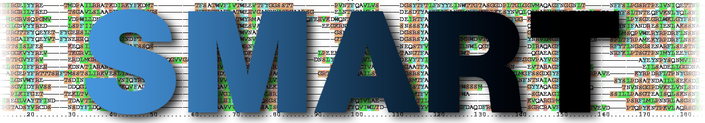


]


---
class: animated, fadeIn

# Protein domains and domain shuffling

> Domains are important, because the function may reside in the domain (and not in the preotin)

#### Tools

.pull-left[

- **InterPro** (https://www.ebi.ac.uk/interpro): freely accessible resource for the classification of protein sequences into families.
  - [Blum (2024)](https://doi.org/10.1093/nar/gkae1082)


]

.pull-right[


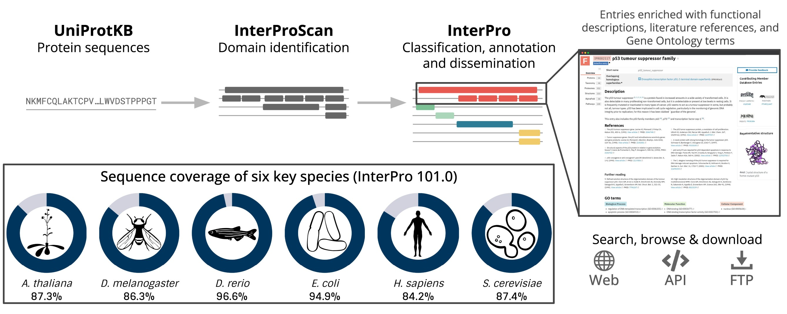


]


---
class: animated, fadeIn

# Protein domains and domain shuffling

> Domains are important, because the function may reside in the domain (and not in the preotin)

#### Tools

.pull-left[

- **InterPro** (https://www.ebi.ac.uk/interpro): freely accessible resource for the classification of protein sequences into families.
  - [Blum (2024)](https://doi.org/10.1093/nar/gkae1082)

<br>
<br>

> All this databases and web tools work at the domain level, avoiding the pitfalls that may arise from whole-protein aligenmtns (e.g. blast)


]

.pull-right[


]


---
class: animated, fadeIn

# Protein domains and domain shuffling

- Domains can be described by Hidden Markov Models (HMM), which specify the likelihood of finding a given residue in a given (relative) position

- HMMs can be derived from multiple sequence alignemtns

- HMM can be used to detect the presence of a given domain in a sequence (i.e. interProScan)

--

<center>
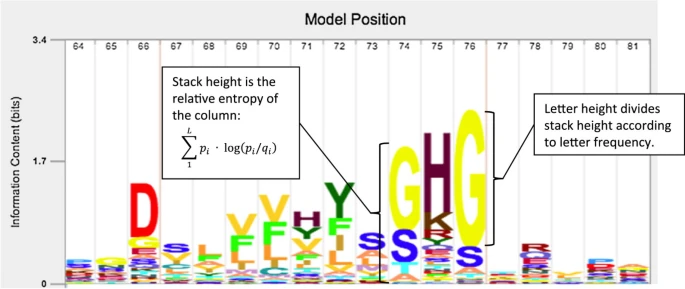
</center>

**Skylign** (http://skylign.org/):  a tool for creating informative, interactive logos representing sequence alignments and profile hidden Markov models ([Wheeler et al. 2014](https://link.springer.com/article/10.1186/1471-2105-15-7))

---
class: animated, fadeIn

# Protein domains and domain shuffling

<center>

</center>

- This logo shows positions 64 to 81 of the Peptidase_C14 profile HMM  from Pfam (PF00656, Pfam 27.0)
- One of the active sites of this Caspase domain is found at position 75.
-  This site is invariant in active peptidases, but not in this profile HMM:
  - The Pfam alignment includes non-peptidase homologs, which do not contain a Histidine at this position
  - HMMER intentionally drives down the information content per position to increase sensitivity to remote homologs.

---
class: animated, fadeIn

# Protein domains and domain shuffling


.pull-left[
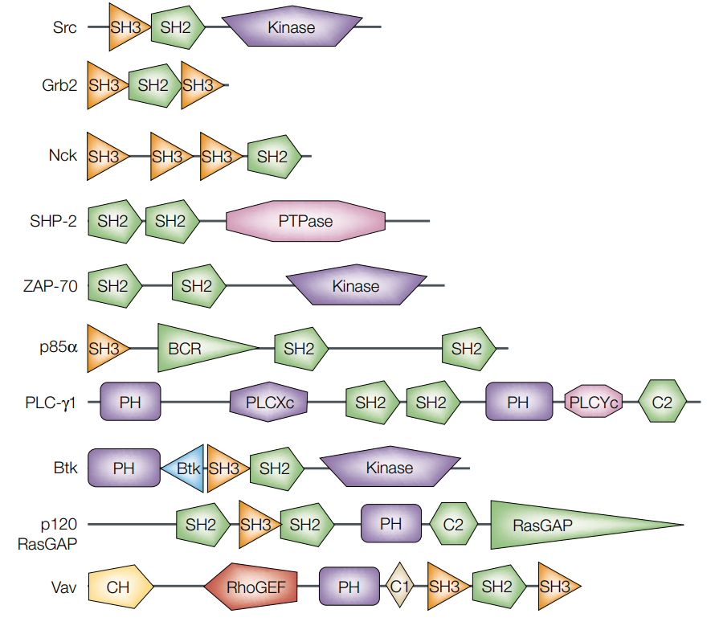

]

.pull-right[

> As domains tend to display a conserved function, function can be inferered from the domains present in a given protein

<br>
*Example*: Modular architecture of some SH2-domain-containing proteins
- Especially in eukaryotes this modular design is particularly abundant
- SH2 domains have subsequently been identified in a wide range of signalling proteins, often together with other
modular signalling domains 
<br>
<br>
<br>
<br>
<br>
<br>
[Yaffe (2002)]( https://pubmed.ncbi.nlm.nih.gov/11994738/)


]
 
---
class: animated, fadeIn

# Prediction of protein subcellular localization

.pull-left[
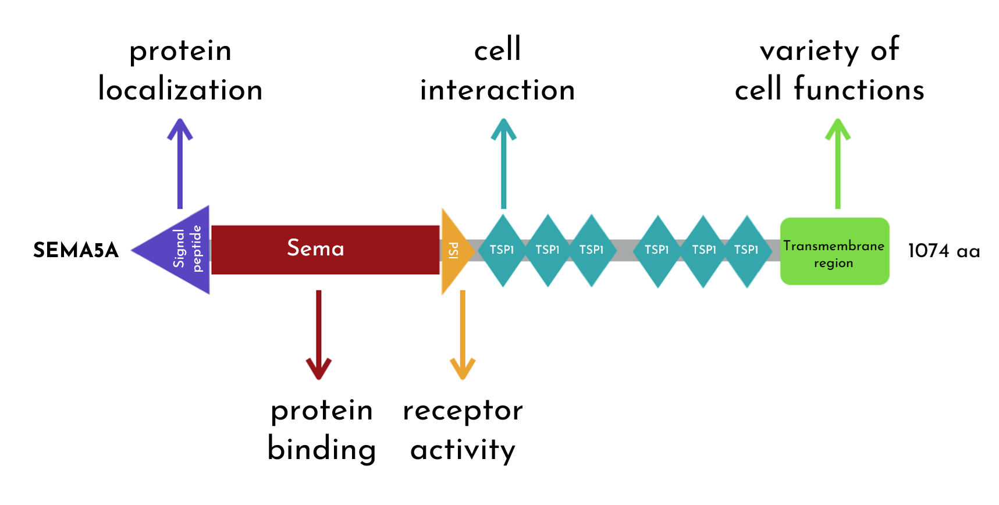
]

.pull-right[
- **Signal peptide**: directs the protein for localization 
- **Sema**: protein binding, specifically during axon guidance 
- **PSI**: receptor activity in multicellular organismal development
- **TSPI** (Thrombospondin type 1 repeats): regulators of cell interactions in vertebrates
- **Transmembrane region**: involved in variety of cellular functions

]


---
class: animated, fadeIn

# Prediction of protein subcellular localization

.pull-left[

]

.pull-right[

- **Motifs**: small unit of a domain or a short region that is assumed to have biological function and is highly conserved
  - Molecular sequences (aa or nucleotides)
  - Structural units (secondary protein structures)
  
- **MEME suite** (http://meme-suite.org/): The MEME Suite is a powerful, integrated set of web-based tools for studying sequence motifs in proteins, DNA and RNA.
  - [Bailey et al. 2015](https://academic.oup.com/nar/article/43/W1/W39/2467905)
]


--

> A protein's function can be investigated by protein domains and motifs.


---
class: animated, fadeIn

# _De novo_ origin of genes

<i class="fa fa-question-circle fa-fw"></i> **How do genes originate?**

--

<center>
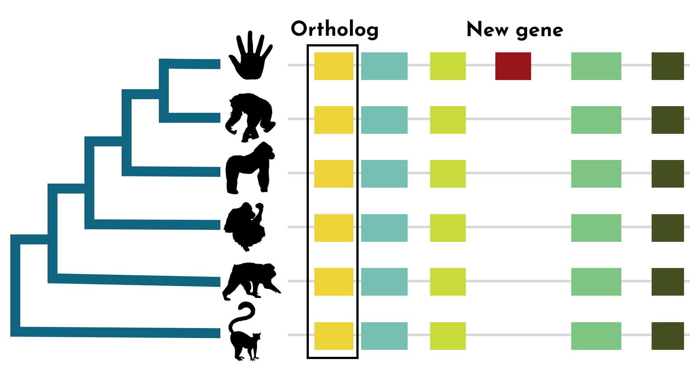

---
class: animated, fadeIn

# _De novo_ origin of genes

<center>
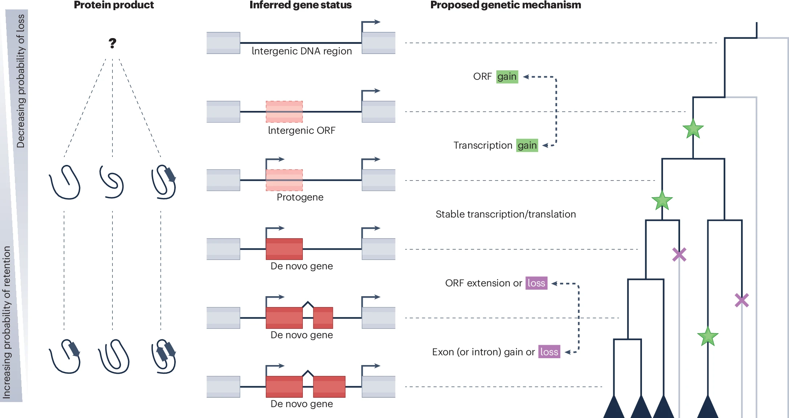
</center>
<small>
[Bornberg-Bauer & Eicholt (2026)](https://www.nature.com/articles/s41576-025-00929-9)

---
class: animated, fadeIn

# _De novo_ origin of genes

.pull-left[

]

.pull-right[
### Validation of novel genes

- **Purifying selection** can aid us in seeing if a region is of importance, since mutations will not be allowed in regions that disrupt function of an element. 
- **Positive selection** is not necessary but can be presen (characteristic of genes that are acquiring novel or improved functionality)
- In **protein-coding genes**, translation is also required. 
- **Taxonomically restricted genes** (recently emerged) should have much of the same properties of established genes. 
- **Species-specific genes** and those with **spurious activity** can’t be compared and do not usually have enough population data. 

]
<small>

[McLysaght & Hurst (2016) )](https://www.nature.com/articles/nrg.2016.78)


---
class: animated, fadeIn

# _De novo_ origin of genes

> **Pervasive transcription** and **transposition of promoters** which enhance the expression allow the region to be subject of **selection**, from where mutations will shape it further into a more active functional unit.

- Mutations originating promoters, increasing expression, extending ORFs, optimizing codon usage...

--

<center>
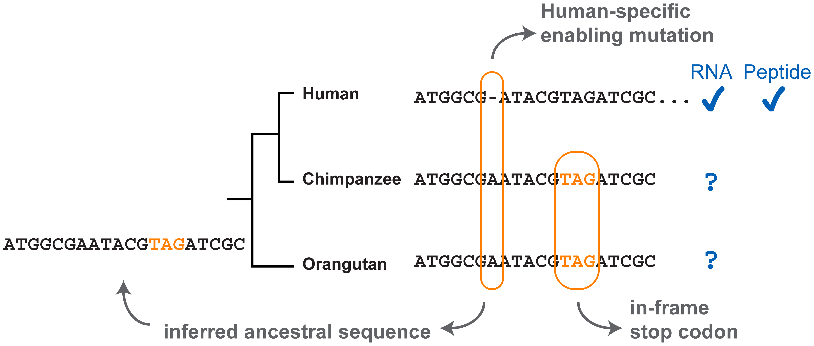
</center>
A hypothetical example where a novel human ORF is created by a human-specific deletion (1 bp deletion shifts a downstream stop codon out of frame).

<small>
[Guerzoni & McLysaght (2011)](https://journals.plos.org/plosgenetics/article?id=10.1371/journal.pgen.1002381)

---

layout: false
class: left, bottom, inverse, animated, bounceInDown
# 04
## Pathways

---
class: animated, fadeIn

# Pathways

.pull-left[
- Many genes encode **enzymes**, which catalyze biochemical reactions
- This series of enzyme-catalyzed reactions are organized into **pathways**

*Example*: Glycolysis and oxidative pentose pathway (A) and Krebs cycle (B)
]

.pull-right[
<center>


]

---
class: animated, fadeIn

# Pathways


For the categorization of enzymatic functions, an effort has been made by the biochemical societies to harmonize the nomenclature. 

> The **EC numbers** (**Enzyme Comission Number**) are four-number codes that hierarchically encompass the function of an enzyme

--

- This allows the complex description of enzymatic function that may be done by researchers into highly comparable and reproducible, standardized code. 

<center>
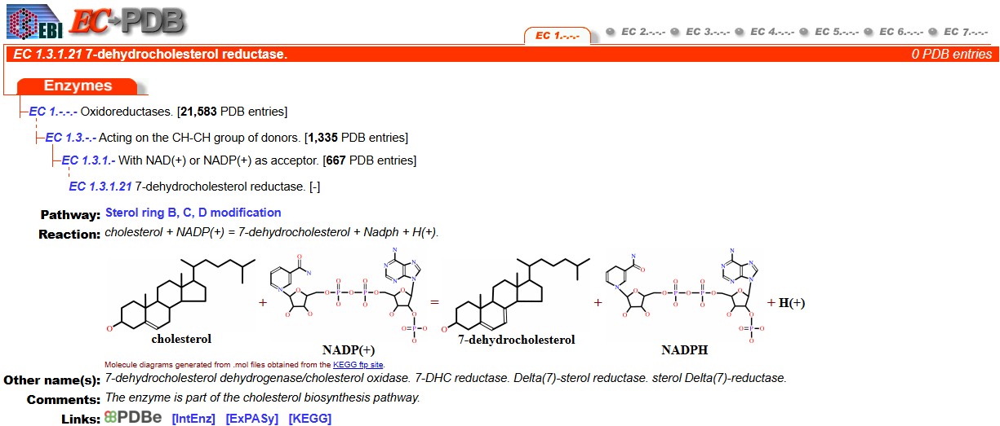

---

class: animated, fadeIn

# KEGG pathway database

#### KEGG (Kyoto Encyclopedia for Genes and Genomes

KEGG (https://www.kegg.jp/) is a database resource for representation and analysis of biological systems. Pathway maps are the primary dataset in KEGG representing systemic functions of the cell and the organism in terms of molecular interaction and reaction networks.

- [Kanehisa et al. (2025)](https://academic.oup.com/nar/article/53/D1/D672/7824602)

<center>
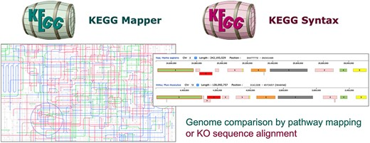


---

class: animated, fadeIn

# KEGG pathway database

.pull-left[
<center>
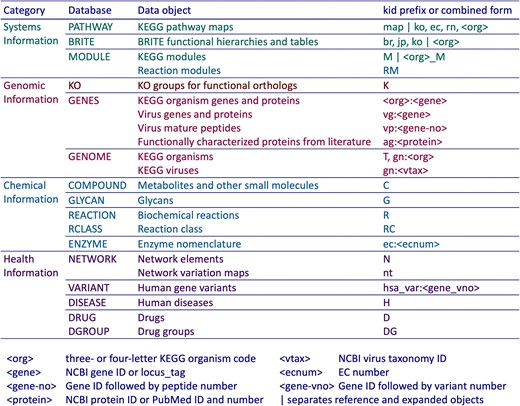
]
.pull-right[
- The KEGG database resource consists of sixteen manually curated databases for various data objects representing:
  - molecular network systems in the systems information category
  - genetic building blocks in the genomic information category
  - chemical building blocks in the chemical information category
  - disease-related perturbed systems in the health information category
]

--

<br>
<br>
<i class="fa fa-question-circle fa-fw"></i> What do we do with non-enzyme genes?

---

class: animated, fadeIn

# Gene Ontology (GO)

- **Ontology**: the study of "being". Ontology often deals with questions concerning what entities exist and how such entities may be grouped, related within a hierarchy, and subdivided according to similarities and differences

- The **Gene Ontology** project aims to:
  - Maintain and develop a controlled vocabulary of gene and gene product attributes
  - Annotate genes and gene products, and assimilate anddisseminate annotation data
  - Provide tools for easy access to all aspects of the data provided by the project, and to enable functional interpretation of experimental data using the GO, for example via enrichment analysis

<center>


https://geneontology.org/

---

class: animated, fadeIn

# Gene Ontology (GO)

.pull-left[
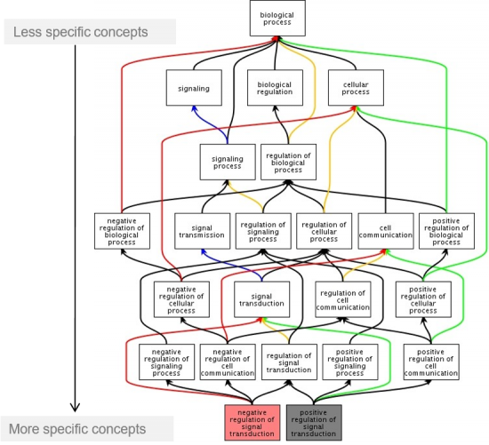
]

.pull-right[
- A way to capture biological knowledge for individual gene products in a written and computable form
- A set of concepts and their relationships to each other aranged as a **hierarchy**
]
---

class: animated, fadeIn

# Gene Ontology (GO)

GO focuses on three aspects of biology:

- **Molecular Function (MF)**: Describes the activities of individual gene products at the molecular level (eg: protein kinase activity, insulin receptor activity)
-	**Biological Process (BP)**: Represents a series of molecular events or functions.  (eg: development, cell division)
-	**Cellular Component (CC)**: Refers to the parts of a cell, including subcellular structures, macromolecular complexes, and the extracellular environment where gene products are located (eg: mitochondrion, mitochondrial matrix)

<center>
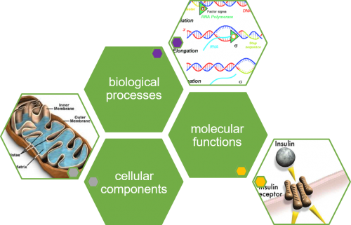

---

class: animated, fadeIn

# Gene Ontology (GO)

| Accession | Name | GO ID | GO term name |Reference |Evidence code |
|--------|-------|------|------|-----|
|P00505 | GOT2 | GO:0004069 |aspartate transaminase activity | PMID:2731362 | IDA

A **GO annotation is** ...

- a statement that a **gene product**

--

- has a particular **molecular function**, *or* is involved in a particular **biological process** *or* is located within a certain **cellular component**

--

- as described in a **particular reference**

--

- as determined by a **particular method**


---


class: animated, fadeIn

# Gene Ontology (GO)

<center>
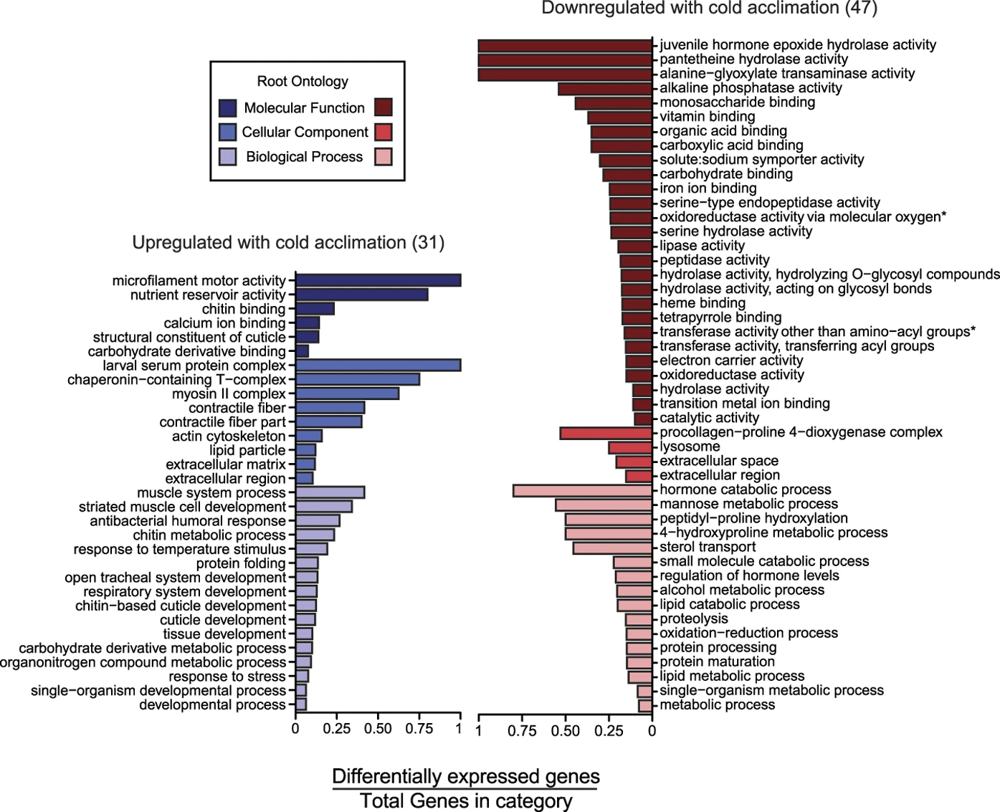
</center>

[MacMillan et al. 2016](https://www.nature.com/articles/srep28999)


---


class: animated, fadeIn

# GO and KEGG analysis in `R`

```{r}
library(clusterProfiler)
library(org.Hs.eg.db)

data(geneList, package="DOSE")

head(geneList)

gene <- names(geneList)[abs(geneList) > 2]

```
---

class: animated, fadeIn

# GO and KEGG analysis in `R`

```{r}
library(clusterProfiler)
library(org.Hs.eg.db)

ego <- enrichGO(gene          = gene,
                universe      = names(geneList),
                OrgDb         = org.Hs.eg.db,
                ont           = "BP", # BP, MF, CC, ALL
                pAdjustMethod = "BH",
                pvalueCutoff  = 0.01,
                qvalueCutoff  = 0.05,
                readable      = TRUE)
```

---

class: animated, fadeIn

# GO and KEGG analysis in `R`

```{r echo = F}
library(DT)
datatable(
  as.data.frame(ego),
  options = list(
    pageLength = 5,
    scrollX = TRUE
  ),
  rownames = FALSE
) |> 
  formatStyle(
    columns = names(as.data.frame(ego)),
    fontSize = "14px"
  )
```

---

class: animated, fadeIn

# GO and KEGG analysis in `R`

```{r fig.align='center', fig.height=6}

dotplot(ego)
```

---

class: animated, fadeIn

# GO and KEGG analysis in `R`

```{r fig.align='center', fig.height=6}

goplot(ego)
```


---

class: animated, fadeIn

# GO and KEGG analysis in `R`

```{r}
kk <- enrichKEGG(gene         = gene,
                 organism     = 'hsa',
                 pvalueCutoff = 0.05)
```


---

class: animated, fadeIn

# GO and KEGG analysis in `R`

```{r echo = F}
library(DT)
datatable(
  as.data.frame(kk),
  options = list(
    pageLength = 5,
    scrollX = TRUE
  ),
  rownames = FALSE
) |> 
  formatStyle(
    columns = names(as.data.frame(ego)),
    fontSize = "14px"
  )
```

---

class: animated, fadeIn

# GO and KEGG analysis in `R`

```{r}
browseKEGG(kk, 'hsa04218')
```

- Will open: https://www.kegg.jp/kegg-bin/show_pathway?hsa04218/2305/4605/9133/890/983/51806/1111/891/776/3708

--

```{r}
library("pathview")
hsa04110 <- pathview(gene.data  = geneList,
                     pathway.id = "hsa04218",
                     species    = "hsa",
                     limit      = list(gene=max(abs(geneList)), cpd=1))
```

- Generates:
<center>
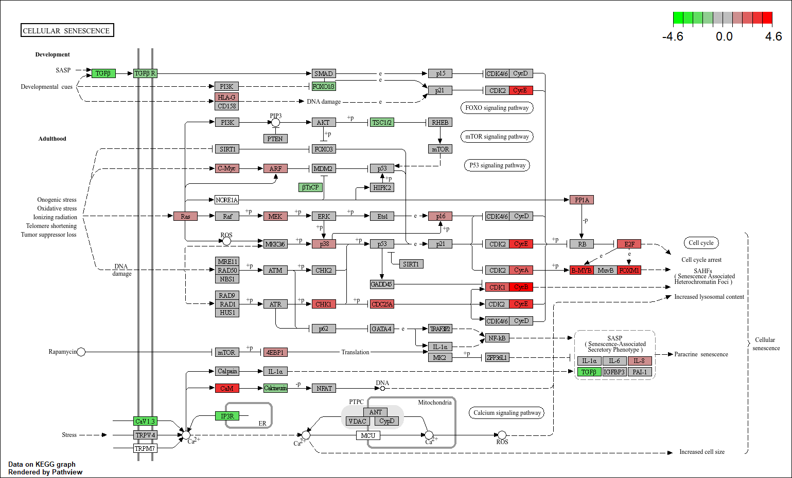 

                     
---
class: animated, fadeIn

# Statistical enrichment

<center>
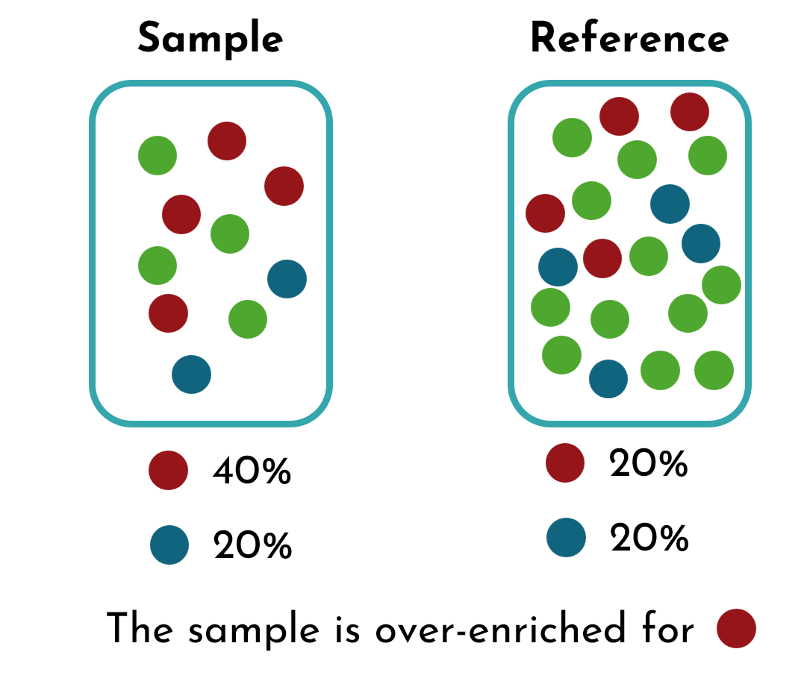

---
class: animated, fadeIn

# Statistical enrichment

- **Fisher's exact test**: test for the exact probability of observing a deviation from a background population in a sample (comparing observed and expected values, or values in a contingency table). It is equivalent to the chi-square test but can be used for cases when the number of values is small (<6)

- **Correction for multiple testing**: you can test for differences in the same sample of many categories (i.e.: enrichment for different colors or functions) and you can perform a Fisher's test for each of these categories. But p-values should be corrected for multiple testing (Bonferroni correction, False Discovery Rate)

*Examples*:
- Are duplicated genes in a genome enriched for certain functions?
- Are overexpressed genes in a given condition enriched for a certain function?
- When comparing a set of genomes, are the shared genes enriched in certain functions?

---
class: animated, fadeIn

# Something that you learnt today?

.pull-left[
<center>

]
.pull-right[

#### <a href="https://www.wooclap.com">www.wooclap.com</a> <i class="fa-solid fa-arrow-right"></i> Event code: **SKTJQE**
]


---
class: animated, fadeIn

## Contact

<div style="margin-top: 20vh; text-align:center;">

| Marta Coronado Zamora | 
|:-:|
| <a href="mailto:marta.coronado@uab.cat"><i class="fa fa-paper-plane fa-fw"></i> marta.coronado@uab.cat</a> | 
| <a href="https://bsky.app/profile/geneticament.bsky.social"><i class="fab fa-bluesky fa-fw"></i>&nbsp; @geneticament.bsky.social</a> | 
| <a href="https://www.uab.cat"><i class="fa fa-map-marker fa-fw"></i>&nbsp; Universitat Autònoma de Barcelona</a> | 

