```{r setup, include=FALSE}
options(htmltools.dir.version = FALSE)
#knitr::include_graphics()
knitr::opts_chunk$set(
  cache = TRUE,
  message = FALSE, 
  warning = FALSE,
  hiline = TRUE,
  fig.retina = 5
)
library(ggplot2)
library(readr)
library(knitr)
#pagedown::chrome_print(".html")
```

```{r xaringan-themer, include=FALSE, warning=FALSE}
library(xaringanthemer)
style_mono_accent(
  base_color = "#1c5253", link_color =  "#DE1144", code_inline_color = "#DE1144",
  header_font_google = google_font("Josefin Sans"),
  text_font_google   = google_font("Montserrat", "400", "400i"),
  code_font_google   = google_font("Roboto Mono"),
    
)
```

```{r xaringanExtra-clipboard, echo=FALSE}
library(xaringanExtra)
htmltools::tagList(
  xaringanExtra::use_clipboard(
    button_text = "<i class=\"fa fa-clipboard\"></i>",
    success_text = "<i class=\"fa fa-check\" style=\"color: #90BE6D\"></i>",
  ),
  rmarkdown::html_dependency_font_awesome()
)
```


class: animated, fadeIn

# Outline

- Homology, Paralogy and Orthology
- Gene families
- Gene duplication, neo- and sub-functionalization
- Methods for predicting orthology and paralogy 

<style>
.title-slide {
  background-image: url('img/1.png');
  background-size: 100%;
}
</style>


---

layout: false
class: left, bottom, inverse, animated, bounceInDown
# 01
## Homology

---
class: animated, fadeIn

# Homology

--

<center>
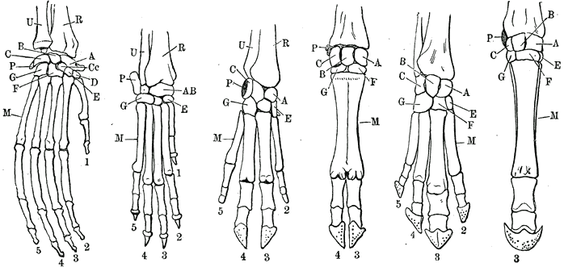

<br><br>

<i>Comparative anatomical representation of the hand skeleton</i>

</center>

---
class: animated, fadeIn

# Homology

<center>


<br><br>

*Comparative anatomical representation of the hand skeleton*

</center>

Richard Owen coined the modern definition of homology in 1843.

> _The same organ in different animals under every variety of form and function_

???
Richard Owen compared extant vertebrates and fossils, and coined this term to explain repeating patterns found in animals

---
class: animated, fadeIn

# Homology

.pull-left[
> **Similarity of features due to inheritance from a last common ancestor**

> Homology it an evolutionary concept, but does not make inference as to function or form
]

.pull-right[
<center>
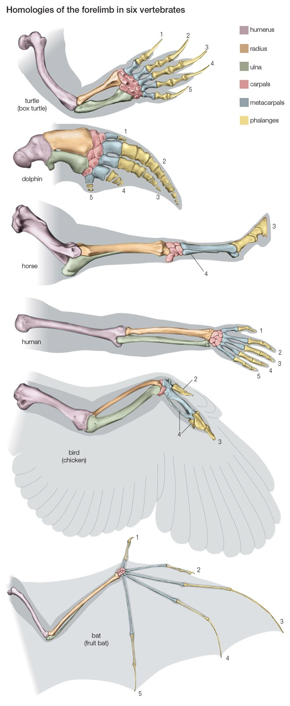 
</center>
]

???
Homology refers to traits in different species that are similar due to a shared common ancestor, often having different functions (e.g., human arms and bat wings)

---
class: animated, fadeIn

# Homology

--

.pull-left[

# *vs.* Analogy

> **A structure with similar functions that evolved independently in unrelated organisms via convergent evolution**

> Homologous as forelimbs but analogous as wings (bird and bat wings)

]

.pull-right[
<center>
 
</center>
]

--

- How does **homology** associate with sequences?

---
class: animated, fadeIn

# Extension of homology to sequences

> Two sequences are homologous if they share a common ancestry

--

<br>

**_Protein alignment_**: the **similarity** between two sequences can be measured in the number of operations needed to transform one into the other: 

<pre style="background-color: #f0f0f0; padding: 10px; border-radius: 6px;">
AAB24882  TYHMCQFHCRYVNNHSGEKLYECNERSKAFSCPSHLQCHKRRQIGEKTHEHNQCGKAFPT 60
AAB24881  --------------------YECNQCGKAFAQHSSLKCHYRTHIGEKPYECNQCGKAFSK 40
                              ****: .***:  * *:** * :****.:* *******..

AAB24882  PSHLQYHERTHTGEKPYECHQCGQAFKKCSLLQRHKRTHTGEKPYE-CNQCGKAFAQ- 116
AAB24881  HSHLQCHKRTHTGEKPYECNQCGKAFSQHGLLQRHKRTHTGEKPYMNVINMVKPLHNS 98
           **** *:***********:***:**.: .***************    :  *.: :
</pre>

--


> We can infer homology from sequence similarity

--

> **How similar do they have to be?**

???
. The symbol * in the bottom row indicates that the two sequences
are equal at that position, whereas : and . indicate decreasing similarity of the
amino acids at that position

---
class: animated, fadeIn

## Similarity and homology

<i class="fa fa-warning"></i> These two terms are often confused, e.g.:

> "_the sequences are 50% homologous_"

> "_these two sequences are highly homologous_"

- **Homology** is a **categorical** term: either two sequences are homologous or not
- **Similarity** is a **quantitative** term, resulting from comparing two sequences (sequence *identity*)

--

<br>

- We use similarity as a proxy of homology: if two sequences are significantly similar, we assume they are homologous

--

- When we calculate the similarity between two sequences, we need some sort of **statistics** to measure similarity (e.g., whether sequences are very similar or really different/result by chance)


---
class: animated, fadeIn

## Result of sequence alignment

<center>
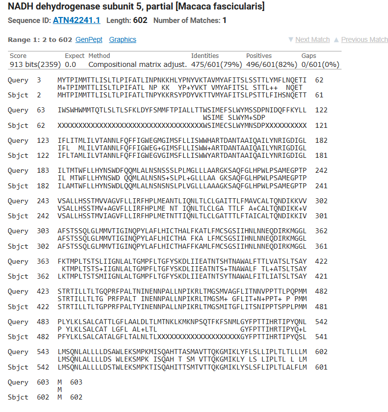 
</center>

---
class: animated, fadeIn

## Result of sequence alignment

### Scoring an alignment

Maximize matches, minimize gaps
  - Simplest scoring:
    - Each match receives a score
    - Mismatches receive a lower score than matches between identical residues
    - Gaps receive penalties

--

**Example scoring**:
- Match: +2
- Mismatch: 0
- Gap: -1


---
class: animated, fadeIn

## Result of sequence alignment

### Number of possible alignments

The number of possible alignments is staggering! For two sequences of length $n$ and $m$, respectively, the number of possible alignments is:

.pull-left[
$$
A(n,m)=\frac{(n+m)!}{m!k!}\approx\frac{2^{2n}}{2\times\pi\times n}
$$
]
.pull-right[
```{r echo = F, fig.height=4, fig.width=4}
library(ggplot2)

# función número de alineamientos para secuencias de igual longitud
A <- function(n) {
  factorial(2*n) / (factorial(n)^2)
}

# datos como en el gráfico (longitudes pequeñas)
df <- data.frame(
  n = 1:10,
  alignments = A(1:10)
)

ggplot(df, aes(x = n, y = alignments)) +
  geom_point() +
  scale_y_log10() +
  labs(
    x = "Length of one sequence",
    y = "Number of alignments"
  ) +
  theme_minimal(base_size = 18)

```

]

(Eddy (2004) What is dynamic programming? 22.7: 909-910)[https://www.nature.com/articles/nbt0704-909]

---
class: animated, fadeIn

## Result of sequence alignment
### Protein scoring

- Protein alignments use a scoring system based on frequencies of aminoacid substitutions in related proteins
- Default scoring matrix is **BLOSUM62**

.pull-left[
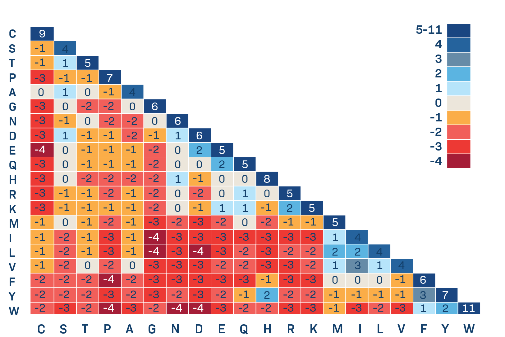
]

--

.pull-right[
- Frequently seen substitutions get positive scores
- Rarely seen substitutions get negative scores
- Substitutions expected by chance get a 0
- Self-matches scores:
  - Common aminoacids (e.g. A, I, L, V) have lower scores
  - Rare amino acids (e.g., W) and those with special roles (e.g. P) have higher scores
]

---
class: animated, fadeIn

## Result of sequence alignment

<center>
 
</center>

---
class: animated, fadeIn

## Result of sequence alignment
### E-value

> **Expectaction value**: the number of sequences that would be expected to have that score (or higher) if the query sequence were compared against a database containing unrelated sequences

$$
E=m·n·2^-S'
$$

where $S'$ is a normalized score and $m$ and $n$ are the sequence lengths.

- Ranges from zero to >10
- The E-value is highly dependent on database 


---
class: animated, fadeIn

## Other aspects in BLAST searches:

- **E-value depends on database size**:
  - Larger databases → higher chance of random matches
  - The same alignment can have different E-values in different databases
  - Important when locally searching in small databases
  
- **Low-complexity filtering**:
  - Mask highly repetitive sequences 
  - Prevents spurious high-scoring matches between unrelated sequences
  - Example: proline-rich regions (`PPPAPPPGPPPPPPAPP`)
  
- **Why multiple HSPs can occur in a hit?**
  - BLAST is a local alignment tool
  - A sequence may share several independent matching regions
  - Each region is reported as a separate High-scoring Segment Pair (HSP)
  
- **Issues with multi domain proteins**:
  - Matches may reflect a shared domain, not full-protein homology

---

layout: false
class: left, bottom, inverse, animated, bounceInDown
# 02
## Orthology and Paralogy

---

class: animated, fadeIn

## Definitions: gene trees evolve inside a species tree

<center>
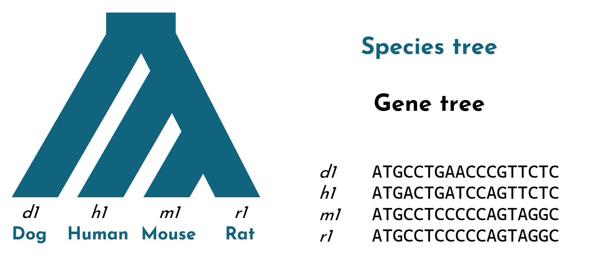 
</center>


---

class: animated, fadeIn

## Definitions: gene trees evolve inside a species tree

<center>
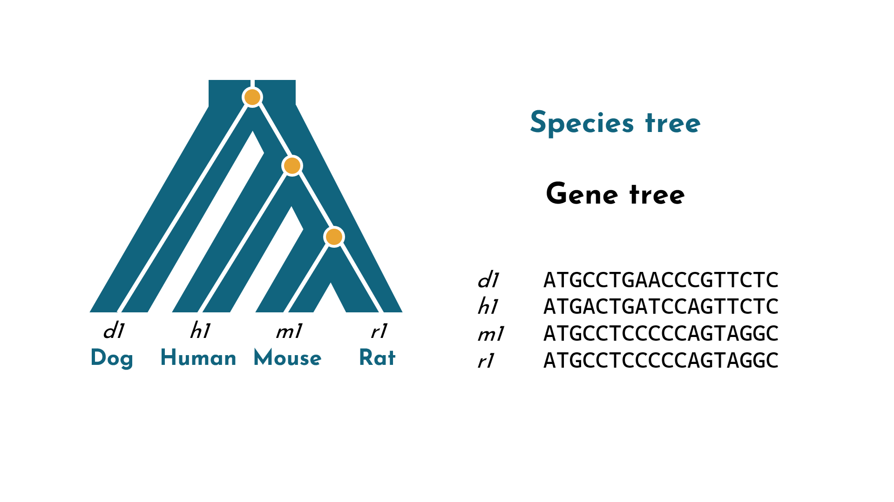 
</center>


---

class: animated, fadeIn

## Species trees help us interpret gene trees

<center>
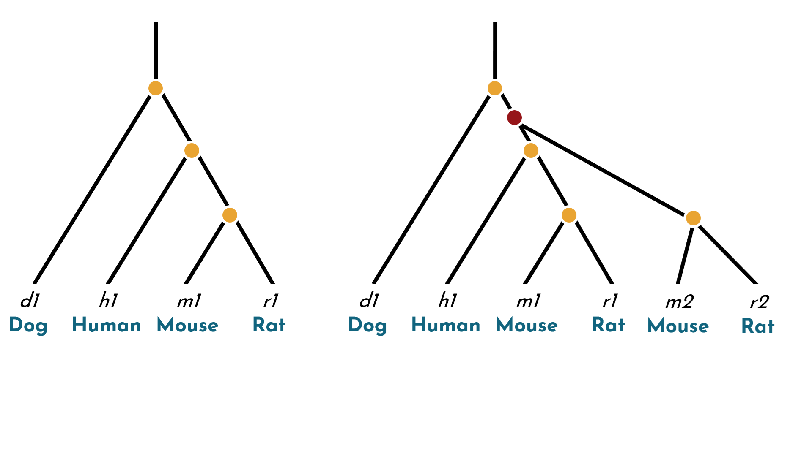 
</center>

---

class: animated, fadeIn

## Definitions: gene family evolution

<center>
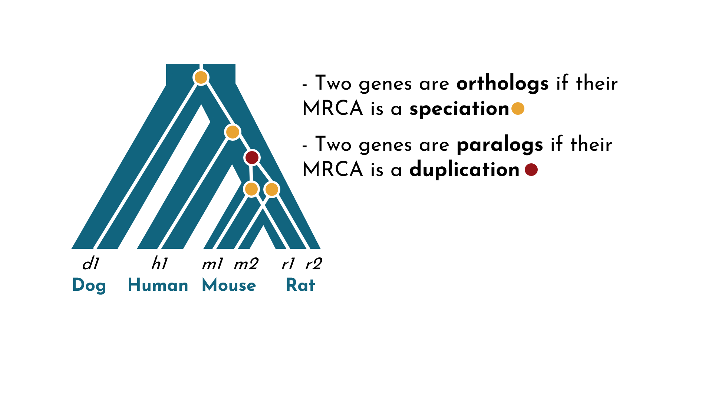 
</center>


---

class: animated, fadeIn


## Definitions: gene family evolution

.pull-left[
> **Original definition of orthology and paralogy by Walter Fitch (1970, Systematic Zoology 19:99-113)**:

> Where the homology is the result of gene **duplication** so that both copies have descended side by side during the history of an organism, the genes should be called **paralogous** (para = in parallel).

> Where the homology is the result of **speciation** so that the history of the gene reflects the history of the species, the genes should be called **orthologous** (ortho = exact)."
]

.pull-right[
<center>
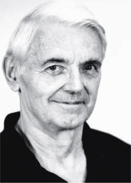
]
---


class: animated, fadeIn


## Example of goblin genes

<center>
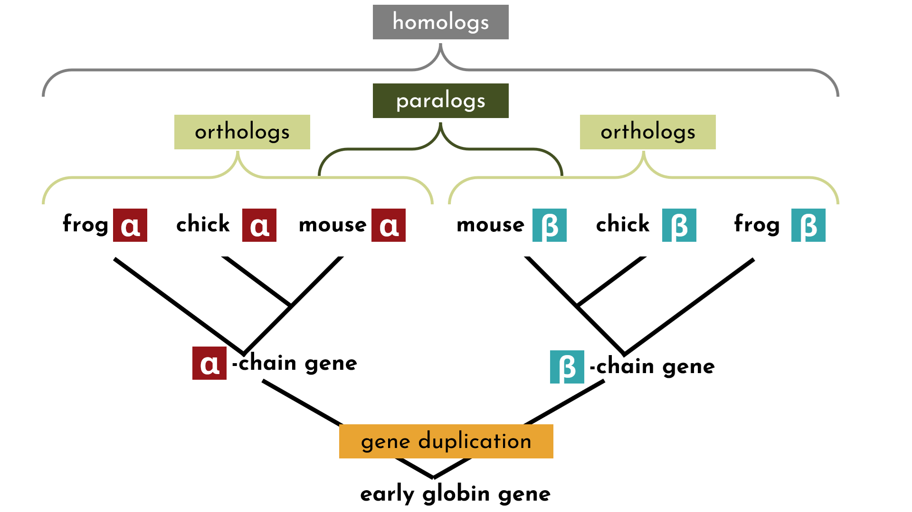

---


class: animated, fadeIn


## As a corollary:


-	**Orthology definition** is purely on evolutionary terms (nor functional, not synteny, ...)

-	There is **no limit on the number of orthologs or paralogs that a given gene can have** (when more than one ortholog exists, there is nothing such as "true ortholog"). 
  - This is particularly problematic when the gene of interest in humans has two orthologs in mouse, for example, and knocking out one may give misleading results

-	**Many-to-many orthology relationships do exist** (co-orthology)

-	There is **no limit on how ancient/recent is the ancestral relationship of orthologs and paralogs**

-	**Orthology is non-transitive** (as opposed to homology)


---


class: animated, fadeIn


## Homology types

<center>


https://www.ensembl.org/info/genome/compara/homology_types.html

---

class: animated, fadeIn


## Are these sentences correct? 

T/F game in wooclap

 We can now discard the sentences from above:
-	Orthologs are homologous genes that have the same function
o	Orthology is purely on evolutionary terms, it does not mention function
-	Orthologs are homologous genes in different species, whereas paralogs are homologous genes in the same species
o	Paralogy can occur within the same species. The terms refer to the point of divergence (speciation or duplication) nor the current relationship of the species
-	The ortholog is the most similar sequence among the homologs in another species
o	Orthology is an evolutionary relationship, not a measure of similarity
-	If gene A is orthologous to the B and gene B is orthologous to gene B, are A and C orthologous to each other?
o	Not necessarily: orthology is non-transitive. In the p53, Homo sapiens p53 is orthologous to D.melanogaster  p53, and D.melanogaster is orthologous to Canis familiaris p73L, but H.sapiens p53 and C.familiaris p73L are not orthologous to each other. 
-	Orthologs are genes that do not duplicate and, when they exist, are always in single-copy
o	There is no limit to the amount of copies an ortholog can have. 
-	After a duplication, the orthologous copy is the one that keeps the function of the ancestral gene
o	Orthology is an evolutionary relationship, a priori unrelated from function

---

class: animated, fadeIn


## Why predicting orthology is important?


1. **Important implications for phylogeny**: only sets of orthologous genes are expected to reflect the underlying species evolution (although there are many exceptions)

--

<center>
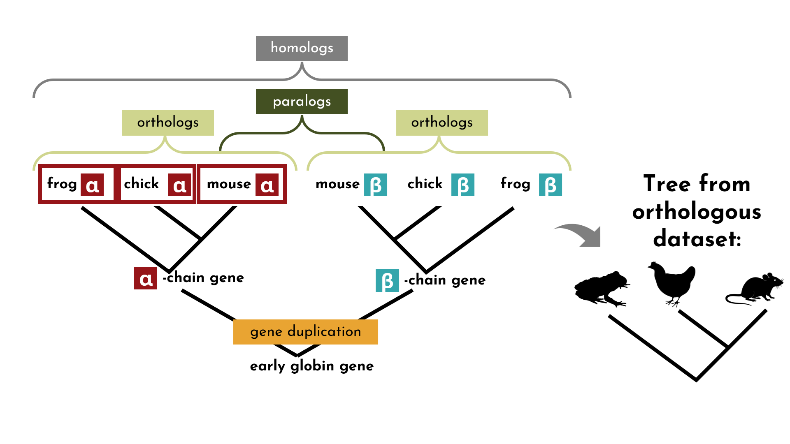


---


class: animated, fadeIn


## Why predicting orthology is important?


1. **Important implications for phylogeny**: only sets of orthologous genes are expected to reflect the underlying species evolution (although there are many exceptions)

<center>


---


class: animated, fadeIn


## Why predicting orthology is important?


1. **Important implications for phylogeny**: only sets of orthologous genes are expected to reflect the underlying species evolution (although there are many exceptions)


<center>
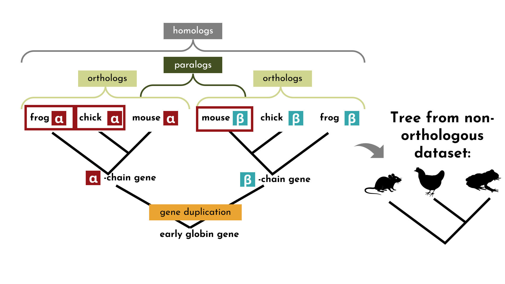

---


class: animated, fadeIn


## Why predicting orthology is important?


1. **Important implications for phylogeny**: only sets of orthologous genes are expected to reflect the underlying species evolution (although there are many exceptions)

<center>


--

</center>

- The tree from a non-orthologus dataset is **not** a **species tree** 


---


class: animated, fadeIn


## Why predicting orthology is important?


2. **The most exact way of comparing two (or more) genomes in terms of their gene content**. Necessary to uncover how genomes evolve.


<center>
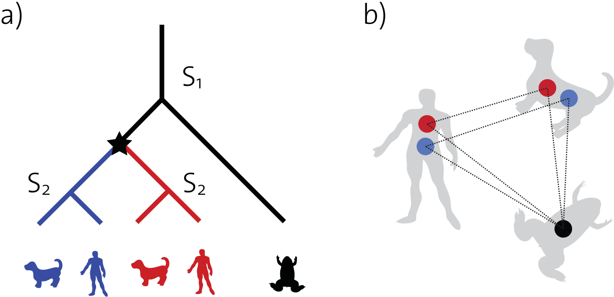
</center>
<small>
(a) Simple evolutionary scenario of a gene family with two speciation events (S1 and S2) and one duplication event (star). The type of events completely and unambiguously define all pairs of orthologs and paralogs: The frog gene is orthologous to all other genes (they coalesce at S1). The red and blue genes are orthologs between themselves (they coalesce at S2), but paralogs between each other (they coalesce at star).
(b) The corresponding orthology graph. The genes are represented here by vertices and orthology relationships by edges. The frog gene forms one-to-many orthology with both the human and dog genes, because it is orthologous to more than one sequence in each of these organisms. ([Source](https://omabrowser.org/oma/type/))

???
Comparative genomics rests on comparison of “equivalent” genes, which is more precise when considering homology and paralogy.

Only by resolving orthology relationships we can figure out the relationship. It is not that the frog lost one human gene, it is that both human genes have the same relationship with the frog gene.

---


class: animated, fadeIn


## Why predicting orthology is important?

3. **Implications for functional inference**: orthologs, as compared to paralogs, are more likely to share the same function.

--

- When a gene duplicates there is redundancy in the genome
- One of the copies eventually degrades into a pseudogene via a deleterious mutation

--

.pull-left[
<center>
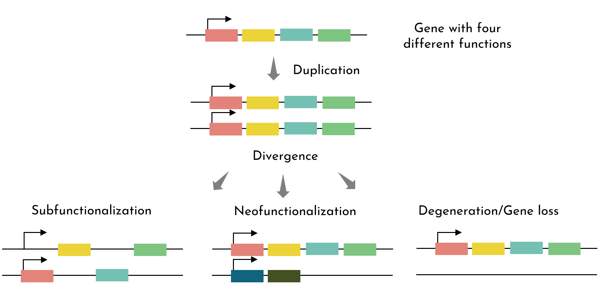
]

.pull-right[
- But if mutations inactive different functions in the differnt copies, the two genes are necessary to maintain the full function (sub-functionalization)
- If one of the copies acquires a new function this second copy may also be kept (neo-functionalization)
]

--

> The process of paralogous retention involves processes of changing on function. Therefore, it is less likely that paralogs maintain function, and are less trusted when employing orthology to transfer function. 

---

class: animated, fadeIn


## The ortholog conjecture: how confident can we be that orthologs are similar? 

.pull-left[
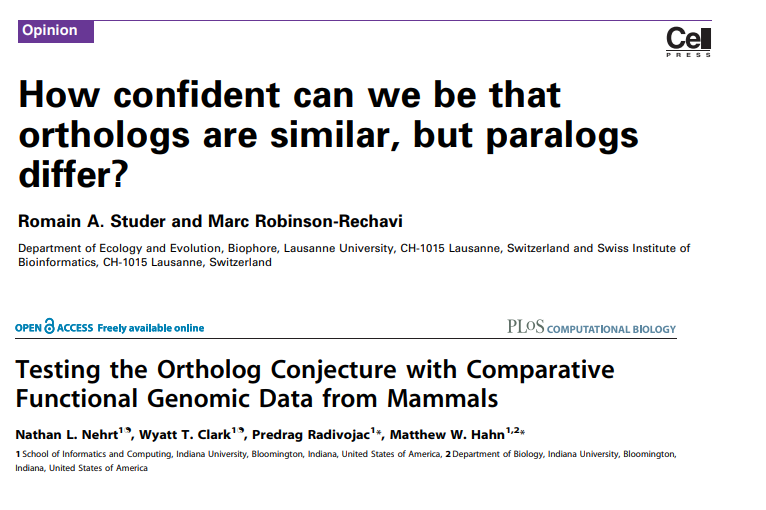
]

.pull-right[

- "_ We present evidence that orthologs and paralogs are not so different in
either their evolutionary rates or their mechanisms of
divergence._"

- "_Both datasets show that paralogs are often a much better predictor of function than are orthologs,
even at lower sequence identities. Among paralogs, those found within the same species are consistently more functionally
similar than those found in a different species._"


]

---

class: animated, fadeIn


## The ortholog conjecture: how confident can we be that orthologs are similar? 

- From [Nehrt et al. (2011)](https://journals.plos.org/ploscompbiol/article?id=10.1371/journal.pcbi.1002073):
  
<center>  
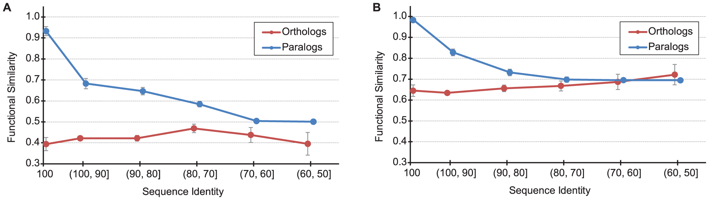

_The relationship between functional similarity and sequence identity for human-mouse orthologs (red) and all paralogs (blue).
Standard error bars are shown. (A) Biological Process ontology, (B) Molecular Function ontology._

---

class: animated, fadeIn


## The ortholog conjecture: how confident can we be that orthologs are similar? 

.pull-left[
- Results were soon being questioned. First concern:

### The usage of GO terms

- Even if they only took experimentally-proven annotations, such annotations are performed on model species, by teams that usually work in the same species. There was a bias of GO similarity for genes by the same paper, group or authors.
]

.pull-right[
<center>
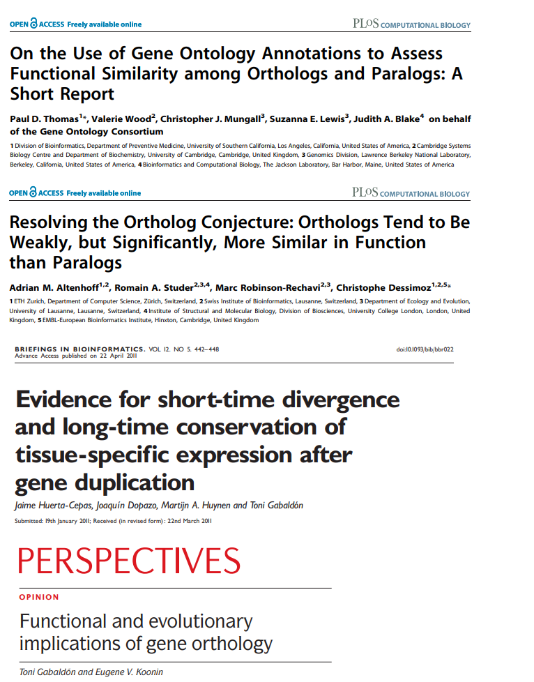
]

---

class: animated, fadeIn


## The ortholog conjecture: how confident can we be that orthologs are similar? 

.pull-left[
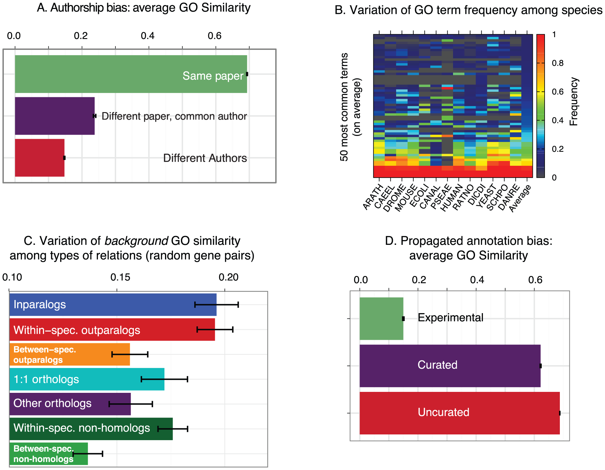
]

.pull-right[
- **Potential confounding factors in GO analyses.**

  - Authorship bias.
  - Variation of GO term frequency among species.
  - Variation of background similarity among species pairs.
  - Propagated annotation bias.


From [Altenhoff et al. 2012](https://journals.plos.org/ploscompbiol/article?id=10.1371/journal.pcbi.1002514)
]


---

class: animated, fadeIn


## The ortholog conjecture: how confident can we be that orthologs are similar? 

.pull-left[
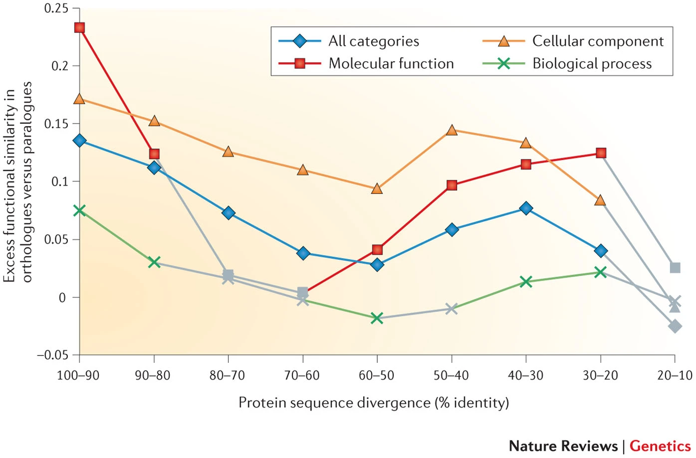
]

.pull-right[
- **Functional divergence versus sequence divergence for orthologues and paralogues.**

  - Plotted is the excess of functional similarity between orthologous pairs of genes as compared to paralogues for different degrees of sequence divergence and for different types of functional ontologies.
  
  - On the whole, the orthology conjecture appears to hold, at least as a statistical trend. Having stated this central conclusion, it is useful to note that another outcome of all these analyses is the rather weak (on average) functional similarity between orthologous genes

From [Gabaldón & Koonin 2013](https://www.nature.com/articles/nrg3456)
]

---

layout: false
class: left, bottom, inverse, animated, bounceInDown
# 03
## Gene families

---

class: animated, fadeIn


# Gene families

.pull-left[
- A group of genes that share a common ancestry (they are homologs)
- Gene families have hierarchical evolutionary relationship (best represented by a tree)
- Members of a gene family can be orthologs or paralogs between them
- An orthologous group is a (or part of) a gene family
- Gene families evolve by duplication and loss (birth and death)
- Because of these loss/duplication dynamics, gene families will vary in size and phylogenetic distribution, where there can exist single-copy families and multi-gene families.
]

--

.pull-right[

<center>
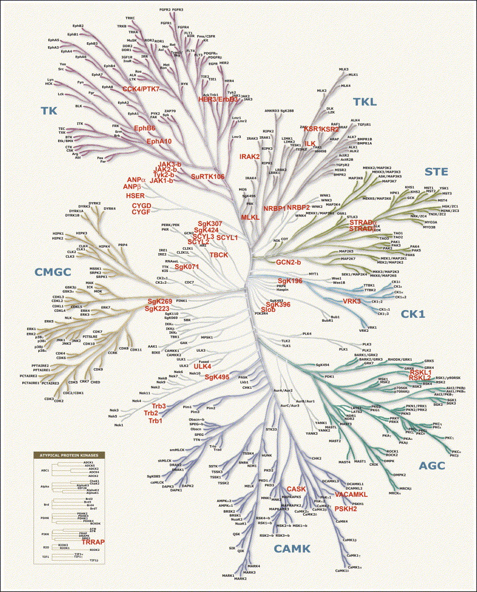

]


There are more than 518 members of the protein kinase family only in humans. [Manning et al. (2002)](https://www.science.org/doi/10.1126/science.1075762) 


---

class: animated, fadeIn


# Gene families

- Proteins within the same gene family tend to have related functions

- But functions can evolve through time

--

This is an example of functional evolution through species diversification:

.pull-left[
<center>
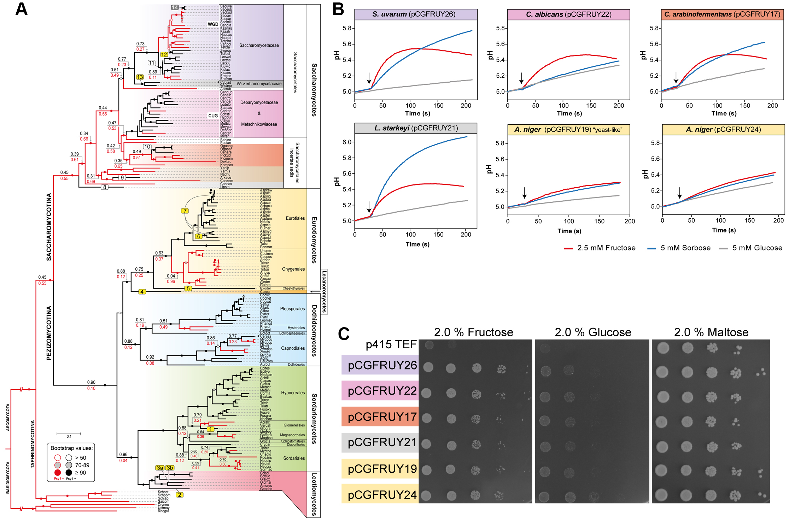
]
.pull-right[
**Functional diversification of a conserved transporter family:**

Across fungal species, FSY1 homologues show different substrate affinities, illustrating how gene function can evolve following species diversification (and be redistributed by HGT).
]


[Coelho et al. (2013)](https://doi.org/10.1371/journal.pgen.1003587)

---

layout: false
class: left, bottom, inverse, animated, bounceInDown
# 04
## Orthology prediction methods

---

class: animated, fadeIn

# Orthology prediction methods: classsic approach

> The classical approach is through phylogenetic inference: 

.pull-left[
1.	Build a gene tree
2.	Compare said tree to the species tree
3.	Infer duplication and speciation events
4.	Assign orthology and paralogy relationships accordingly


]


---

class: animated, fadeIn

# Orthology prediction methods: classsic approach

> The classical approach is through phylogenetic inference: 

.pull-left[
1.	Build a gene tree
2.	Compare said tree to the species tree
3.	Infer duplication and speciation events
4.	Assign orthology and paralogy relationships accordingly

_The tree depicts the evolutionary relationships among several metazoan members of the p53 family, ranging from insects to mammals. As can be inferred from the tree, several duplications (nodes marked with gray circles) occurred at different periods. Most significantly, two consecutive duplications at the base of the vertebrates originated three sister groups (shadowed regions in the tree) that correspond to the p53, p73 and p73L subfamilies._ [Gabaldón 2008](https://link.springer.com/article/10.1186/gb-2008-9-10-235)

]

.pull-right[

<center>
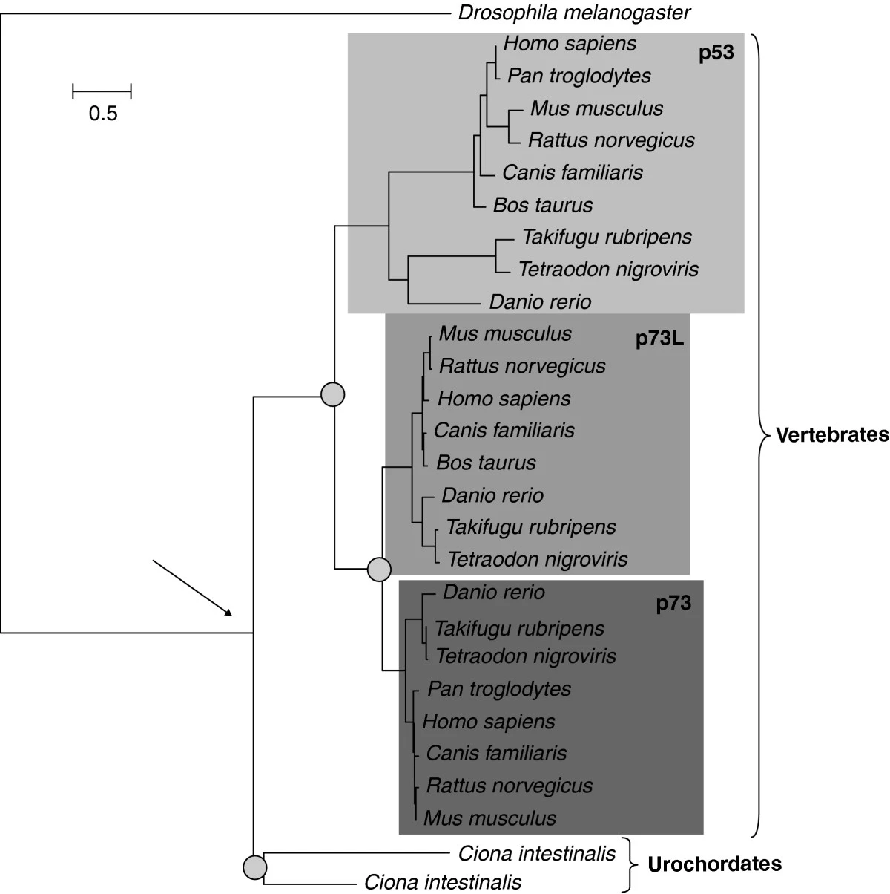


]


---

class: animated, fadeIn

# Orthology prediction methods: genome-wide approach

> When doing genome-wide scale analyses, everything must be done automatically and “blind”. 

--

.pull-left[
<center>

]

.pull-right[

Similarity-based approaches:
- **Best bi-directional (reciprocal) hits**
- **InParanoid approach**
- **Clusters of orthologous groups (COG)**, **Markov clustering algorithm (MCL)-clustering approach**

Phylogenetic-based approaches:
- **Tree-reconciliation phylogenetic approach**
- **Species-overlap phylogenetic approach** (PhylomeDB)

[Gabaldón 2008](https://link.springer.com/article/10.1186/gb-2008-9-10-235)

]


---

class: animated, fadeIn

## Best reciprocal hit (BHR)

--

.pull-left[
<center>

]

.pull-right[

- (a) **Best bi-directional (reciprocal) hits** - **All pairs of proteins with reciprocal best hits are considered orthologs.**

- If the best hit of gene A is gene B, and the best hit of gene B is gene A, they are assumed to be orthologs
- Note that this method is unable to predict the orthology with the yellow protein 2.
- This method detects all orthologies as one-to-one. So it cannot deal with many-to-many relationships.
- It is also highly affected by paralogy. 
- It does have a low rate of false positives, but high rates of false negatives. 
- However, it is the simplest and fastest method, still widely used. 
- It is recommended for closely-related organisms and in situations where duplications are not excepted.


]

---

class: animated, fadeIn

## InParanoid approach

--

.pull-left[
<center>

]

.pull-right[

- (c) **Inparanoid approach - Like (a), but other proteins within a proteome (yellow protein 2 in this example) are included as 'in-paralogs' if they are more similar to each other than to their corresponding hits in the other species.**

- It starts finding BRH, and then searches within the same genome, and any hit that is closer to the query than to the ortholog is considered to be a paralog
-  The conclusion is not that gene A and gene B are orthologs, but that group A and group B are orthologs to each other. This one, therefore, can handle many-to-many relationships. 
- The key assumption is that the paralogy from group A is more recent than the speciation of genes A and B (in-paralogs). 


]

--
> Definition of in- and out-paralogues require the specification of a
given speciation-node of reference

---

class: animated, fadeIn

## COG-like approach

.pull-left[
<center>

]

.pull-right[

- (b) **COG-like approach. Used by many databases like STRING.
** 

- Proteins in the nodes of triangular networks of BBHs are considered as orthologs (green, red and yellow protein 1 in the example). 
- New proteins are added to the orthologous group if they are present in BBH triangles that share an edge with a given cluster (e.g., the gray protein will be added to the group because it forms a BBH triangle with the red and green proteins. Note that a BBH link with yellow protein 1 is not required.)
- The COG-like approach can add additional proteins from the same genome if they are more similar to each other than to proteins in other genomes, or if they form BBH triangles with members of the cluster. This is not the case for yellow protein 2, which is, again, misclassified.

 

]

???
The name “orthologous group” is confounding, since it contains genes that are orthologous to each other as well as genes that are paralogous to each other.

---

class: animated, fadeIn

## COG-like approach

--

.pull-left[
<center>
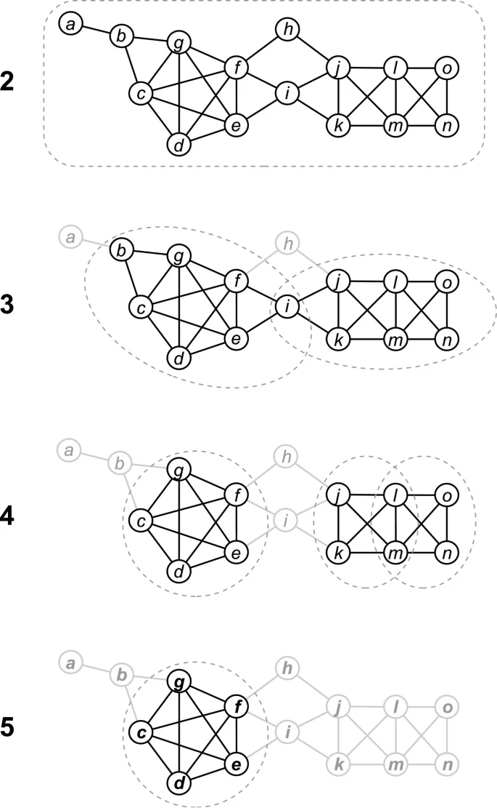
]

.pull-right[

- (b) **COG-like approach.** 


- COGs at varying stringencies. As stringency increases, poorly connected vertices drop out of COGs and COGs may split


]

???
The name “orthologous group” is confounding, since it contains genes that are orthologous to each other as well as genes that are paralogous to each other.

---
class: animated, fadeIn

### Clustering methods produce: **orthologous groups** 

- Equivalent to the earlier concept of sub-family

- Orthologous groups = Group of sequences derived from a single gene in a common ancestor. They may include orthologs and in-paralogues
  
- Each orthologous group has implicit the specification of an **ancestral
species of reference** (a speciation node)


---
class: animated, fadeIn

### How many orthologous groups?

<center>


--

3 at the level of vertebrates, 1 at the level of chordates

---

class: animated, fadeIn

## Additional useful definitions

>	**In-paralogs and out-paralogs** ([Sonnhammer & Koonin 2002](linkinghub.elsevier.com/retrieve/pii/S0168-9525(02)02793-2)): It is defined relative to a given speciation event. In-paralogs are derived from duplications occurred subsequent to the speciation event, and therefore specific to one lineage, whereas out-paralogs are paralogs emerged from duplications occurred before the speciation. If you change the speciation event, these relationships will change.

>	**Orthologous groups** (orthogroups) are also defined relative to a speciation event. It is the complete set of genes in one of the lineages formed by a speciation event, including both orthologs and in-paralogs, so not all genes in an orthologous group are orthologous to each other.

--

<center>
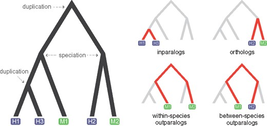
</center>
<small>
- Four different types of homology relations. A family of five genes sampled from human (in blue) and mouse (in green) evolves through speciation and duplication events (left-hand tree).

---
class: animated, fadeIn

## Hierarchical orthologous groups

- The definition of a reference ancestral species is just an approximation to the inherently hierarchical nature of gene family evolution, and is thus incomplete. To alleviate this, many databases define orthologous groups at various hierarchical levels. 

- To alleviate this, many databases define orthologous groups at
various hierarchical levels (e.g Metazoa, Vertebrates,
Mammals, Primates)


---
class: animated, fadeIn

## Hierarchical orthologous groups

- Hierarchical orthologous groups are defined as sets of genes that have descended from a single common ancestor within a taxonomic range of interest ([Altenhoff et al. 2013](https://journals.plos.org/plosone/article?id=10.1371/journal.pone.0053786))

--

<center>
The insulin gene in mammals<br>
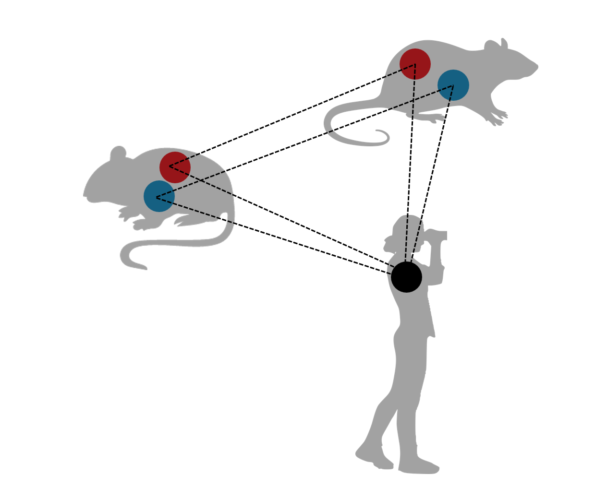
</center>


---
class: animated, fadeIn

## Hierarchical orthologous groups

<center>
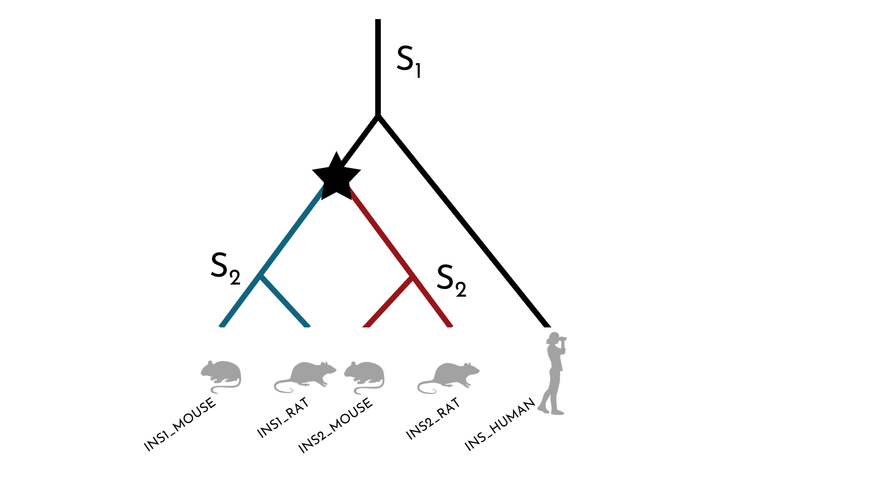
</center>

- In ancestral mammal: one insulin gene
- S<sub>1</sub>: mammalian speciation
- S<sub>2</sub>: rodent speciation
- Star: duplication event


---
class: animated, fadeIn

## Hierarchical orthologous groups

<center>
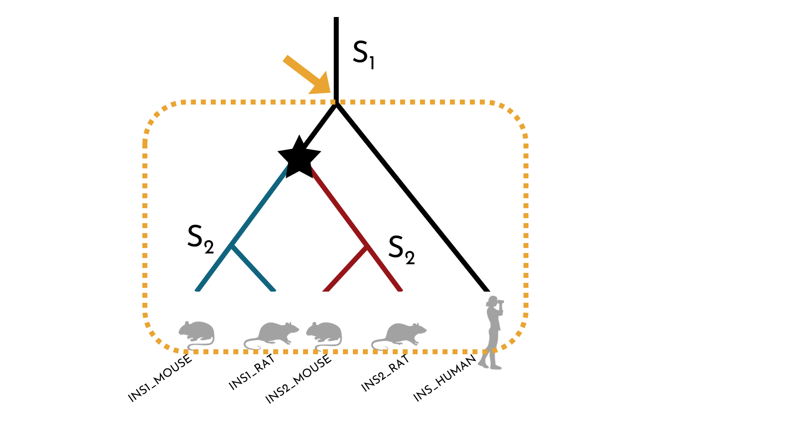
</center>

- There's only one copy of the insulin gene in the ancestor of all mammals so all insulin genes in mammals are derived from it and should be in one **HOG**

- In terms of orthology and paralogy relationships, a HOG contains orthologs and in-paralogs

---
class: animated, fadeIn

## Hierarchical orthologous groups

<center>
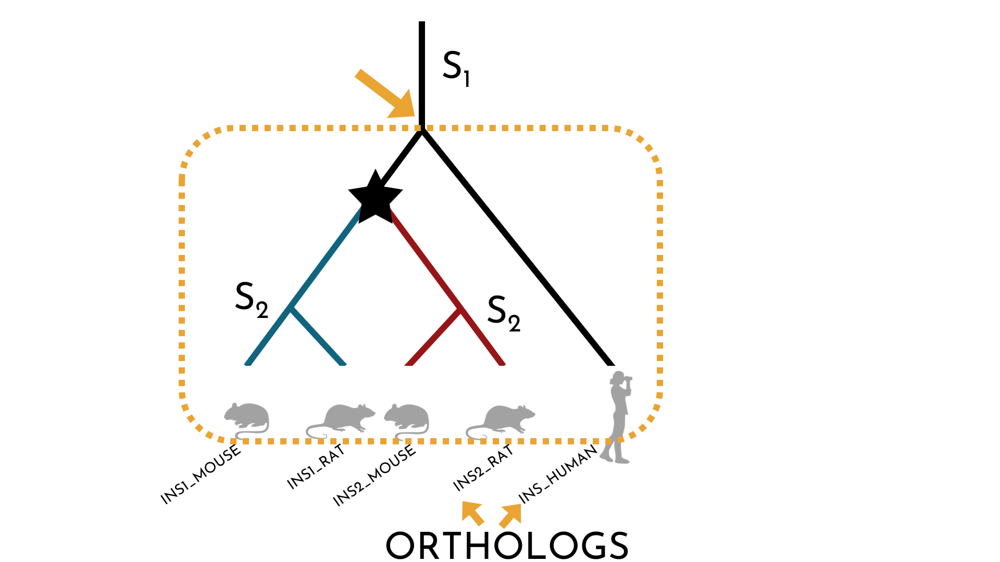
</center>

- Orthologs are genes relateb by speciation 
- This could be the basal speciation (S1)


---
class: animated, fadeIn

## Hierarchical orthologous groups

<center>
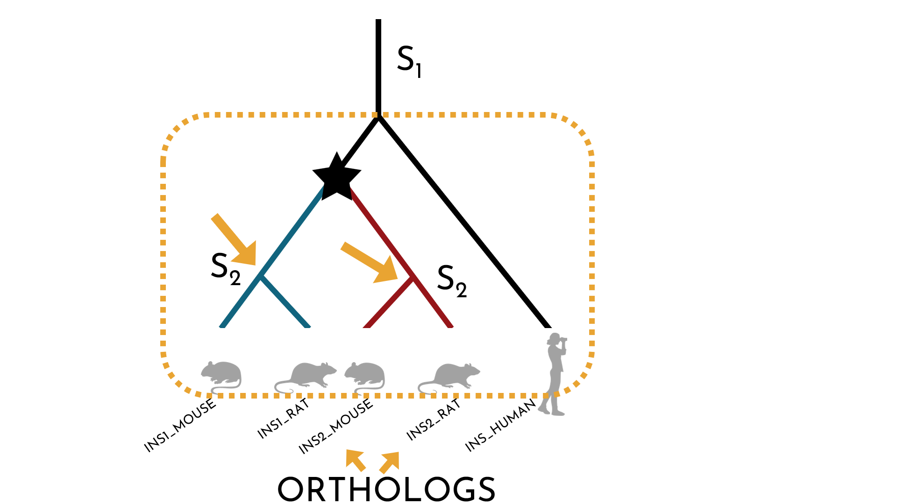
</center>

- Or could be a subsequent speciation (S2)


---
class: animated, fadeIn

## Hierarchical orthologous groups

<center>
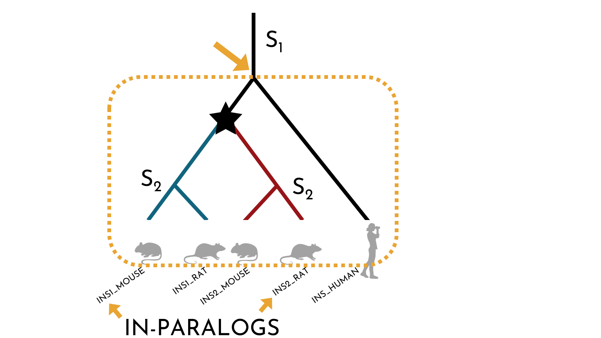
</center>

- In-paralogs: genes related by a duplication, but importantly these duplications must have happened within the clade in question
- Insulin 1 in mouse and insuline 2 in rat are in-paralogs relative to all mammals and are therefore in the same HOG at this level

---
class: animated, fadeIn

## Hierarchical orthologous groups

<center>
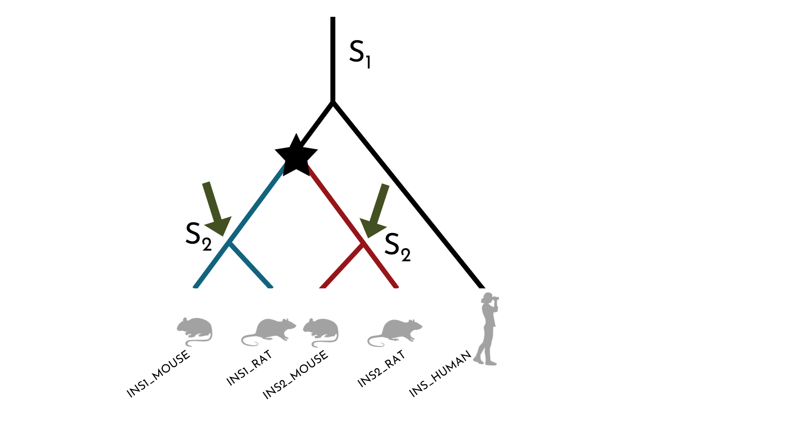
</center>

- Because of the duplication, mice and rats have two insulin genes suggesting that their common ancestor already had these two copies, so each insulin gene in present-day mice can be traced back to one or the other copy

---
class: animated, fadeIn

## Hierarchical orthologous groups

<center>
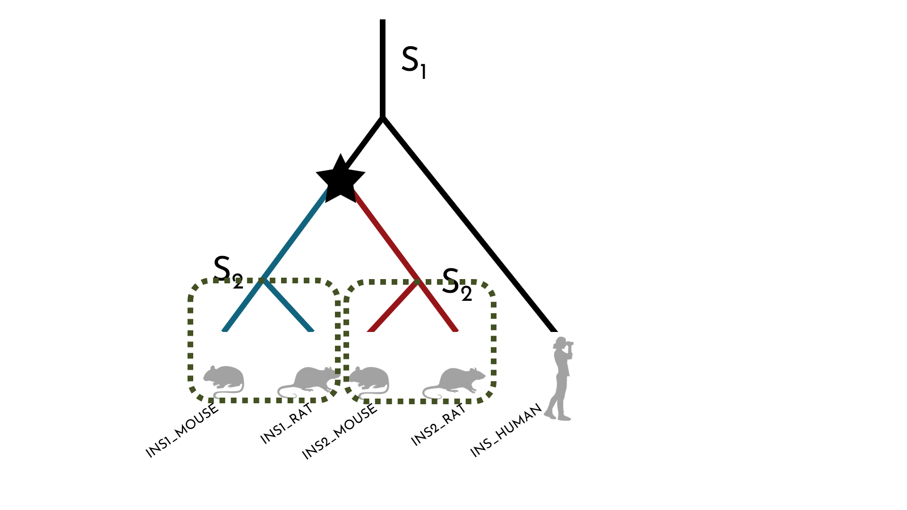
</center>

- This defines two HOGs
- You can see that it's really important to define the clade that is the taxonomic level for which the HOG are defined

---
class: animated, fadeIn

## Hierarchical orthologous groups

<center>
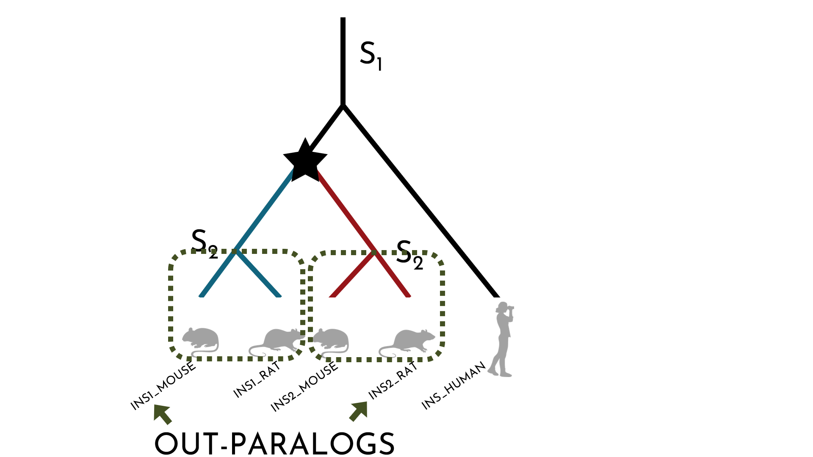
</center>

- By contrast at the rodents taxonomic level, insulin 1 in mouse and insulin 2 in rats are out-paralogs
- They started diverging at a duplication that happened before the rodent speciation: they are in different HOGs relative to this level 

---
class: animated, fadeIn

## Hierarchical orthologous groups

<center>
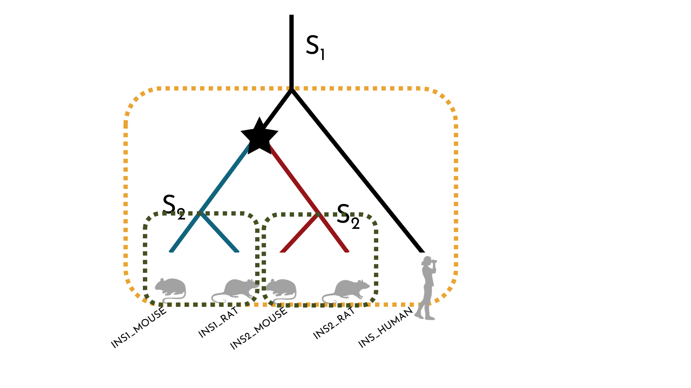
</center>

- If we compared HOGs defined at different levels we see that the more basal HODS encompass multiple smaller HOGs: this is where the hierarchical part of the name comes from 


---
class: animated, fadeIn

## Hierarchical orthologous groups

<center>
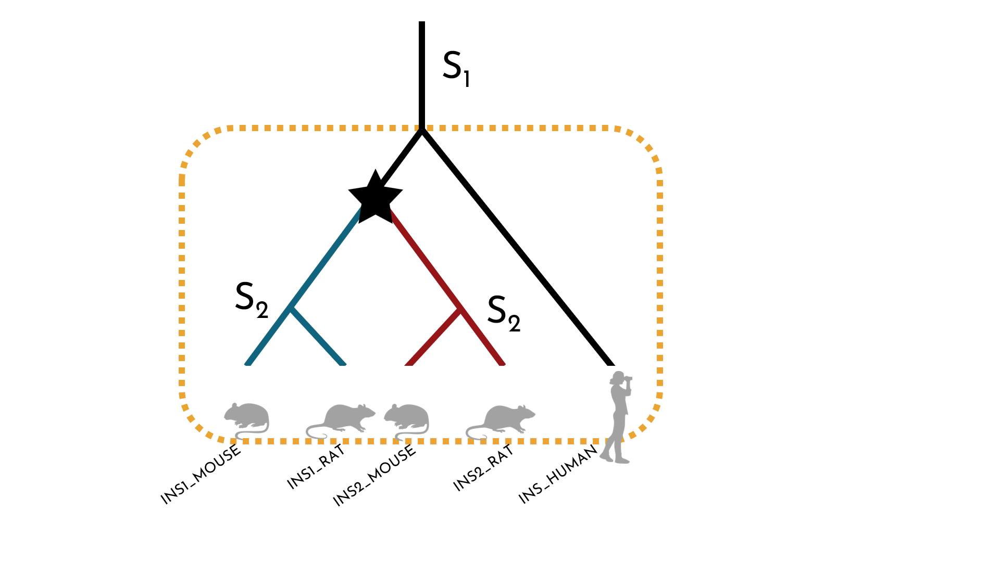
</center>

- When we say that the insulin gene in mammals we refer to the collective members of one and only insulin HOG defined at the level of all mammals

---
class: animated, fadeIn

## Hierarchical orthologous groups

<center>

</center>

- We refer to the two rodent copies, we mean we should consider two types of genes which might have differentiated in subtle ways
- We distinguish insulin 1 form insulin two (two HOGs at that level)


---

class: animated, fadeIn

# Recap: similarity-based methods

These BLAST-based methods are fast and scalable, which is an advantage, but as of late methods based on phylogeny have improved where fast pipelines and algorithms are available: ENSEMBL trees, PhylomeDB, TreeFam, ...

- Methods based on phylogeny where not used at a large scale due to limitations in computational power (phylogenetics is costly)

---

class: animated, fadeIn

# Phylogeny-based methods

General procedure:
- Reconstruct the evolution of a gene family (phylogenetics)
- Detect duplication and speciation nodes 
- Predict orthology and paralogy accordingly

--

There are two main methods for predicting duplication and speciation nodes from a tree:

- Species tree reconciliation (RIO; Ensembl)
- Species-overlap algorithms


---


class: animated, fadeIn

# Species tree reconciliation

.pull-left[

<center>
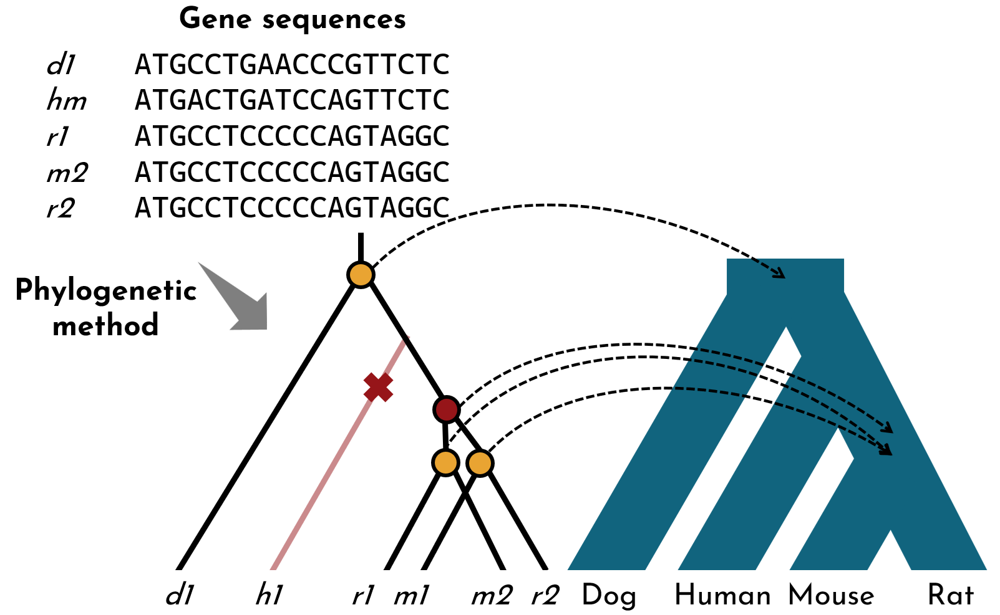
</center>
]

.pull-right[

- We can start inferring events in a gene family 
- Taking all of the sequences of the gene family
- Building a gene tree
- Reconciling that gene tree on the species tree (obtained previously using a species tree method) obtaining the duplications and losses
  - Take many orthologs for the species and find a consensus tree that recapitulates the order of divergence events for that species

]


---
class: animated, fadeIn

# Reconciliation problem

- Maximum parsimony reconciliation (MPR)
  - Given: gene tree **G** and a species tree **S**
  - Find: reconciliation **R** that implies the fewest duplications (and/or losses)
  
<center>
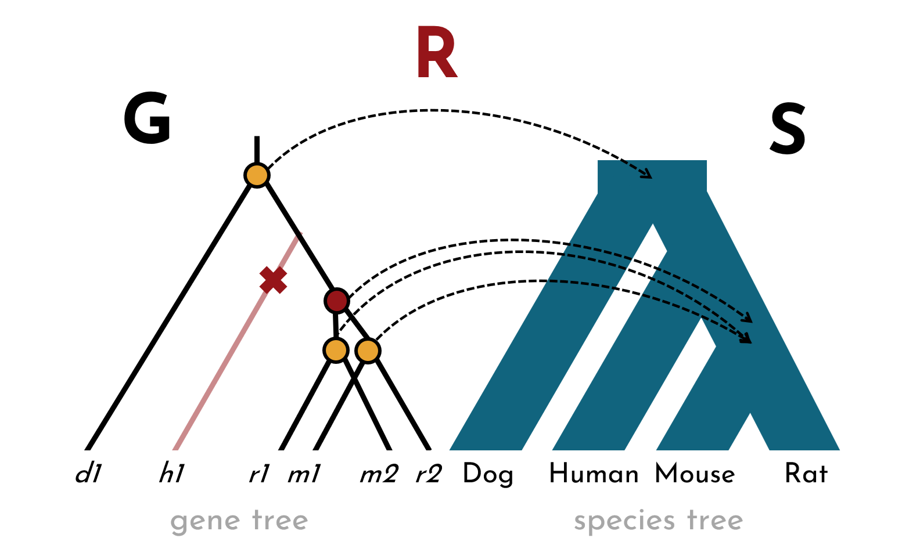
</center>  


---

class: animated, fadeIn

## Example of reconciliation (1)


<center>
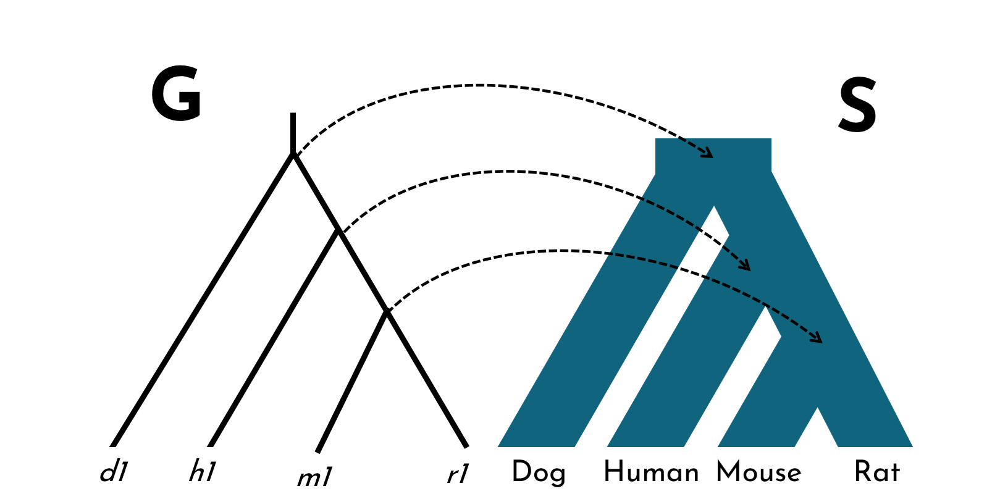
</center>

- 0 duplications
- 0 losses 
- Every pair of gene are orthologs


---


class: animated, fadeIn

## Example of reconciliation (1)


<center>
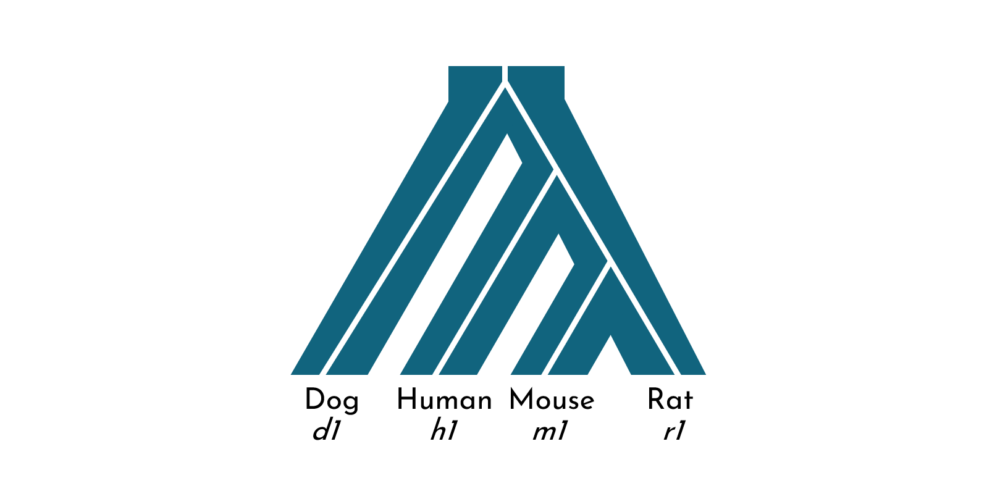
</center>

- 0 duplications
- 0 losses 
- Every pair of gene are orthologs

---

class: animated, fadeIn

## Example of reconciliation (2)


<center>
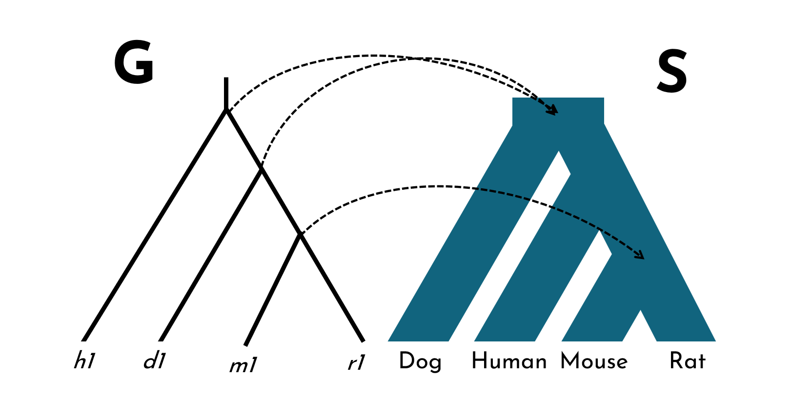
</center>

- 1 duplications
- 3 losses 
- h1 is a paralog with d1, m1, r1


---


class: animated, fadeIn

## Example of reconciliation (2)


<center>
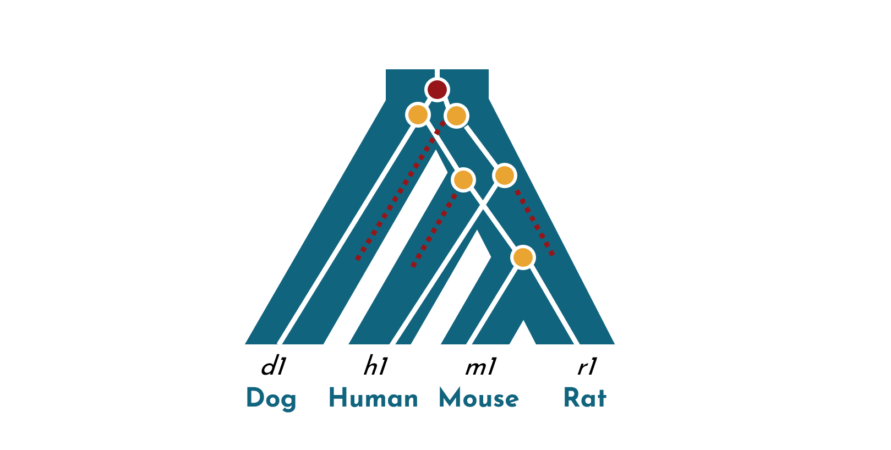
</center>


- 1 duplications
- 3 losses 
- h1 is a paralog with d1, m1, r1


---


class: animated, fadeIn

## Problem of reconciliation

- As soon as you have a discrepancy in the **topology of the gene tree**, that immediately implies of multiple duplication and loss events.

--

Reconciliation with the species tree readily provides you information on speciation and duplication nodes in a tree.

**It works well when these two assumptions are correct:**

- **We know the true species tree**: some clades do not have a species tree which is reliable
- **The gene tree is correct and reflects the species evolution**: reconstruction algorithms in the gene tree  in the sense that genes are exclusively vertically inherited (HGT, hybridization, ...)

---


class: animated, fadeIn

##  Species-overlap algorithm
To deal with topological variability, it was implemented a **species-overlap** algorithm ([Huerta-Cepas et al. 2007](https://link.springer.com/article/10.1186/gb-2007-8-6-r109))

- It does not require a species-tree but needs to know the species to which the genes belong
- In essence can be seen as a reconciliation with an unresolved species tree
- For every node in the gene tree evaluate whether the daughter partitions share any species. If the overlap (number of species shared over total number of species) is higher than the given threshold. Inpute a duplication at that node 

<center>
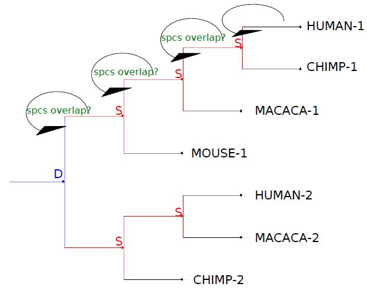

---

class: animated, fadeIn

##  Species-overlap algorithm

The species-overlap algorithm (PhylomeDB) is highly accurate and less affected by gene tree/species tree artifacts than tree-reconciliation

<center>
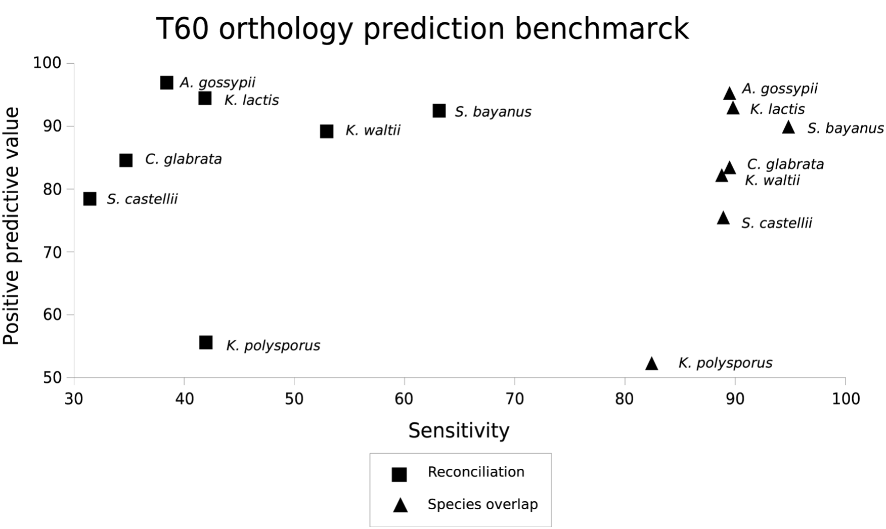

[Marcet-Houben & Gabaldón (2009)](https://journals.plos.org/plosone/article?id=10.1371/journal.pone.0004357)

In yeast, synteny (conservation of gene order) is strong, so it can be used as proxy for the accuracy of the prediction. 
---

class: animated, fadeIn

## Quest for orthologs 

https://questfororthologs.org/

A plethora of methods for ortholog prediction

<center>
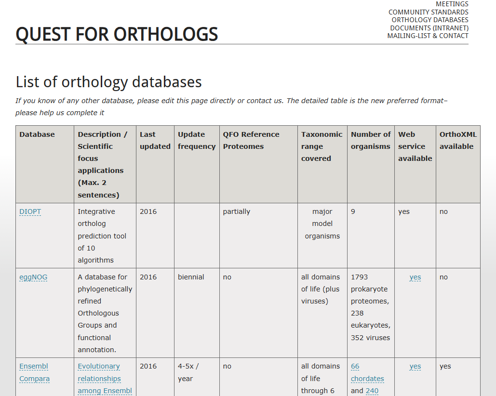

???
With over 30 orthology databases, based on various methods, which ones to choose?
-	Different taxonomic focuses
-	Different methodologies
-	Different outputs (pairwise relationships, groups, etc)
-	Different interfaces
-	Different accuracies: how to benchmark this? Which proxies to use?


---

class: animated, fadeIn

## Things to consider

- Working with incomplete genomes (transcriptome data, etc):
  - Check number of family members in related species with complete genomes
  - Compare relative distances with other genes
  - Use complete genomes as an anchor in blasts and phylogenies
  - Be aware of artificial duplications caused by split gene models

- Non-vertical modes of inheritance

- Multidomain proteins

- Functional inference from orthology

---
class: animated, fadeIn


## Things to consider

.pull-left[
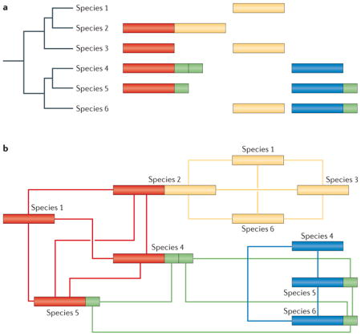
]

.pull-right[
- The genocentric definition of orthology becomes problematic when homologous proteins in different species differ in domain architecture. 
]


---
class: animated, fadeIn

## Contact

<div style="margin-top: 20vh; text-align:center;">

| Marta Coronado Zamora | 
|:-:|
| <a href="mailto:marta.coronado@uab.cat"><i class="fa fa-paper-plane fa-fw"></i> marta.coronado@uab.cat</a> | 
| <a href="https://bsky.app/profile/geneticament.bsky.social"><i class="fab fa-bluesky fa-fw"></i>&nbsp; @geneticament.bsky.social</a> | 
| <a href="https://www.uab.cat"><i class="fa fa-map-marker fa-fw"></i>&nbsp; Universitat Autònoma de Barcelona</a> | 

